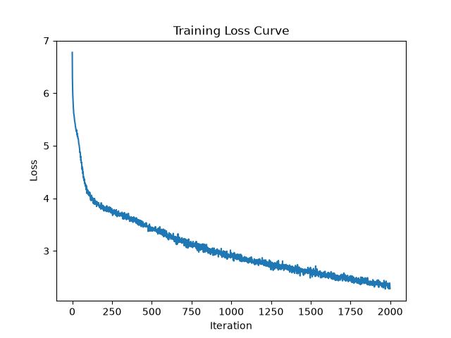

# Prenorm Ablation

Comparing model performance and training stability when using prenorm vs residual norm (original transformer architecture).

## Method

All hyperparameters are identical between runs except for matrix dtype. Both runs use the same tokenizer (BPE, 500 merges), same dataset (`shakespeare.txt`).

| Hyperparameter | Value |
|---|---|
| `batch_size` | 64 |
| `block_size` | 256 |
| `max_iters` | 2000 |
| `eval_interval` | 200 |
| `learning_rate` | 3e-4 |
| `eval_iters` | 200 |
| `n_embd` | 384 |
| `n_head` | 6 |
| `n_layer` | 6 |
| `dropout` | 0.2 |

## Results Summary

| Architecture | Best val loss | Final train loss (step 2000) | Avg ms/iter |
|---|---|---|---|
| Residual (post-norm) | 3.1631 (step 1600) | 2.2078 | ~670 |
| Prenorm | 3.1420 (step 1400) | 2.0982 | ~675 |

**Note: ignore ms/iter because they weren't running under the same conditions on my laptop (all other applications closed vs not, etc.)

I included best val loss and final train loss both since both models are overfitting, and this allows us to compare the "best version" of each architecture. The prenorm model achieved a lower best val loss and a lower final train loss, so it performed better technically but not enough for me to confidently say it isn't just noise. However, if you look at the interval losses, it shows that for steps 1-1800, both architectures performed within ~0.02-0.03 of each other. Only on step 2000 did the prenorm model loss drop dramatically, which means it could just be noise.

Here's a side by side comparison of the two loss curves:
| Residual (post-norm) | Prenorm |
|---|---|
|  |  |

The two loss curves look pretty much identical. I was expecting the prenorm to have less norm and be more stable, but that doesn't seem to be the case here either. 

## Analysis

I think the likely explanation here is that it's a pretty straightforward and small-scale model/task. The model has just 6 attention heads, the vocab size is 756, and the data set is quite pristine without any irregularities. The model val loss has already plateaued; it's probably learned the task as well as it can given constraints (data, model size, etc.), to the point that it's overfitting. So the prenorm architecture doesn't really have any advantage here. Prenorm is supposed to provide gradient stability at depth, but we don't need help with that in this model. I think if I were to run this on a larger model with more heads, more layers, and a larger dataset, the prenorm architecture would likely show its advantages.

I also think that to accurately do more expirements like this, it may be worthwhile to opt for a larger model and try to use cloud compute so that I can genuinely see the difference and observe the effects of different innovations that I'm experimenting with. Additionaly, I want to do more analysis on why overfitting is so prevalant here and try to mitigate it.

## Residual layernorm (original transformer architecture) results
```
chars-per-token: train 2.2327, val 2.1384
step    0: train 6.3093, val 6.2699,                1279.39 ms/iter
step  200: train 3.7914, val 3.9761, bpb 2.6825,      681.45 ms/iter
step  400: train 3.5353, val 3.7741, bpb 2.5462,      681.87 ms/iter
step  600: train 3.2121, val 3.5278, bpb 2.3797,      685.22 ms/iter
step  800: train 2.9614, val 3.3478, bpb 2.2582,      669.98 ms/iter
step 1000: train 2.7592, val 3.2536, bpb 2.1953,      664.90 ms/iter
step 1200: train 2.6090, val 3.1878, bpb 2.1509,      667.11 ms/iter
step 1400: train 2.4703, val 3.1738, bpb 2.1414,      665.68 ms/iter
step 1600: train 2.3345, val 3.1631, bpb 2.1341,      667.40 ms/iter
step 1800: train 2.2049, val 3.1903, bpb 2.1525,      667.09 ms/iter
step 2000: train 2.2078, val 3.2116, bpb 2.1692,      666.81 ms/iter
```


**Sample output**

```
court is, injust of it.
Your honour intent made for time; coward finding greatness,
As Still but night shall paradise which
As cries for hate it, for no more empty dive sorrow.

GREMIO:
The word 'Of Fear and i' the eye belongs:
So, my lord. Turn my grows!' they do sound, sir;
Questaid, good Signior Baptista!
Mastera, never to acquaint Alas,
Though Paulina's love to me.
In this devise Rome, I pray thee, give me thou;
And see what keeper than thou art.
BA Place; I do could have more help
Is a truthless sms was true; for hence:
God-place will boot, and tooth all these woes,
Have I left weightness wint a roeat;
And I am crada bed, seeing more,
Than become my creaged torment's wind will bear me.
Will no more law
Deser hatered of her death,
If I must confess of a word's daughter; then your flood, throngs' handless
Since present watch word in your down,
And yet she unleeply bite danger:
And when I had so doubterer, may serve your plead,
And sever'd succlof,
I'll dally a true flies are marigal to his royal now.

DUKE OF YORK:
Can this bride the aunt of mine eyes.

DUKE OF YORK:
Yet givener, my grandam, lords, g
```

## Prenorm results
The layer norm was moved out of the residual stream and applied before the multi-head attention and feedforward blocks. This is the "prenorm" architecture, which has been pretty widely accepted as the new normal.

```
step 1: train loss 6.3005, val loss 6.2852, val bpb 4.3053, ms/iter 1155.71
step 200: train loss 3.7825, val loss 3.9332, val bpb 2.6942, ms/iter 676.21
step 400: train loss 3.5273, val loss 3.7083, val bpb 2.5401, ms/iter 671.47
step 600: train loss 3.2020, val loss 3.4646, val bpb 2.3732, ms/iter 669.47
step 800: train loss 2.9543, val loss 3.3074, val bpb 2.2655, ms/iter 672.51
step 1000: train loss 2.7744, val loss 3.2230, val bpb 2.2077, ms/iter 687.20
step 1200: train loss 2.6195, val loss 3.1675, val bpb 2.1697, ms/iter 667.80
step 1400: train loss 2.4793, val loss 3.1420, val bpb 2.1522, ms/iter 670.14
step 1600: train loss 2.3528, val loss 3.1701, val bpb 2.1714, ms/iter 680.63
step 1800: train loss 2.2195, val loss 3.1630, val bpb 2.1666, ms/iter 685.79
step 2000: train loss 2.0982, val loss 3.2140, val bpb 2.2015, ms/iter 682.72
```


**Sample output**

```
cellow.

CORIOLANUS:
So.

AUFIDIUS:
Well, your gates, sir,
Your subitious three grazeners gates
Tullusers for the people's ears.

CORIOLANUS:
Citizen, malk of Polixenes! I must hear my prayer
Accuse thee. Peace do the same yield,
Thus with all base deal seass o' myself!
Must stabil thus my power, boy: look you so?

COMINIUS:
Nay, and do present vanate,
Within your officer; to deforth, take the least
To see Romans. Neighbour, have heard him speak,
Our two hurling stol'n your manses on:
'Tis he me; and in some ne'er your hate, or
And your honour thanks names we power. I pray you, good legot;
And you bed, good work, 'tis becomes: gas well
You are their own. They'll me, beloved we
Do there's no life and good hungry brows
To the posture meet them owe's name; north,
Too much forswith meeming them as always to done.

COMINIUS:
Prepare yourselves: what is't o'clughters to their dos,
Whichsadiarel, my charge being alrelands,
It doubting your Rome should law:
Whenew would might be piled
What you speak a words content; nor dance,
Should be left the officer, gives out of your gentry,
Then g
```