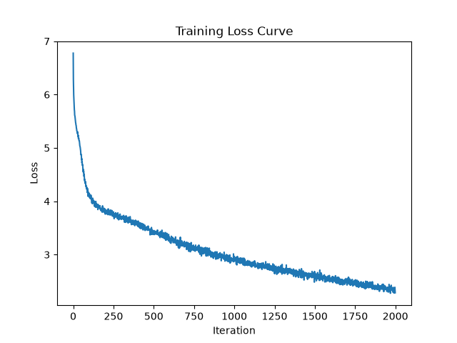
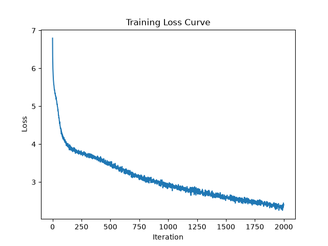

# RMSnorm vs LayerNorm

Exploring affects on the model's training speed, loss, and generation quality when using RMSnorm instead of LayerNorm.

## Hypothesis

RMSNorm is obviously less memory intensive than LayerNorm, so it's supposed to reduce the runtime while also not affecting loss much. 
- I expect that the loss will be similar to LayerNorm with differences small enough to be considered noise. I expect this because losing the mean component of the normalization probably won't change much considering how pristine and small this dataset is. 
- I do, however, expect that runtime will be faster with RMSNorm. I am expecting (and hoping) to see ms/iter decrease pretty significantly since the model as a whole is small and the noramlization layer is probably taking a disproportioantely large amount of time.

## Method

Since comparing ms/iter is very important for this experiment, I'm going to try to run the model under the exact same conditions for both runs. This means closing all other applications, maintaining full charge, and running the model on MPS (since I don't have CUDA). 

Beyond that, I'm going to keep all other hyperparameters stagnant.

## Results summary

| Metric | LayerNorm | RMSNorm | Δ (RMS vs LN) |
|---|---|---|---|
| ms/iter (steady state, steps 200–2000) | ~670–674 | ~752–761 | +~12% slower |
| ms/iter (step 1, cold start) | 825.35 | 1064.64 | +29% slower |
| Final train loss (step 2000) | 2.0988 | 2.0830 | -0.0158 |
| Final val loss (step 2000) | 3.2131 | 3.2011 | -0.0120 |
| Best val loss (step 1400) | 3.1415 | 3.1336 | -0.0079 |
| Final val bpb (step 2000) | 2.2009 | 2.1927 | -0.0082 |

## Analysis

My first hypothesis that RMSNorm and LayerNorm would have similar loss values is correct and remains correct throughout the training. 

However, the second hypothesis was very much incorrect. RMSNorm took significantly longer to run than LayerNorm, which is not only the opposite of what I expected, but also the opposite of what much research suggests. RMSNorm is less computationally and memory intensive than LayerNorm, and I expected that to be reflected.

The only things that changed in implementation are that I switched nn.LayerNorm with nn.RMSNorm and removed the bias term from the normalization (which shouldn't affect much). So, I'm currently trying to explore of torch RMSNorm is optimized for MPS, or if there's some sort of MPS implementation that has occurred for LayerNorm that hasn't occurred for RMSNorm, causing the discrepancy.

I'm going to further investigate to 1) see if there was something I implemented incorrectly, 2) see if there is a known issue in torch RMSNorm with MPS, and 3) look into the actual torch implementations of RMSNorm and LayerNorm to see if there's something that would explain the discrepancy.

## Update

When I use torch.compile for RMSNorm layer, the issue pretty much goes away and RMSNorm becomes significantly faster. However, If I don't use torch.compile, RMSNorm is significantly slower than LayerNorm on both MPS and CPU. To see the actual expirement I ran, refer to `experimentation/RMSnorm.py`. I want to further investigate this and understand torch backend along the way, so I'm going to start a new repository to explore this issue in more depth. The new repo is called `torch-RMSnorm-investigation` and can be found on my Github profile.

When I use torch.compile for RMSNorm, I get 640 to 660 ms/iter, which is faster than LayerNorm! See the raw results at the bottom of this file.


## Raw results
**LayerNorm**
Reran this underneath the same conditions as RMSNorm to get a more accurate comparison of ms/iter rather than pulling from a previous run.

```
using MPS
chars-per-token: train: 2.2338, val: 2.1062
step 1: train loss 6.3005, val loss 6.2852, val bpb 4.3053, ms/iter 825.35
step 200: train loss 3.7825, val loss 3.9333, val bpb 2.6942, ms/iter 674.02
step 400: train loss 3.5272, val loss 3.7083, val bpb 2.5402, ms/iter 671.80
step 600: train loss 3.2013, val loss 3.4647, val bpb 2.3733, ms/iter 670.98
step 800: train loss 2.9541, val loss 3.3071, val bpb 2.2653, ms/iter 670.69
step 1000: train loss 2.7739, val loss 3.2225, val bpb 2.2073, ms/iter 669.44
step 1200: train loss 2.6186, val loss 3.1670, val bpb 2.1693, ms/iter 670.39
step 1400: train loss 2.4787, val loss 3.1415, val bpb 2.1519, ms/iter 669.91
step 1600: train loss 2.3531, val loss 3.1696, val bpb 2.1712, ms/iter 672.08
step 1800: train loss 2.2196, val loss 3.1652, val bpb 2.1681, ms/iter 670.75
step 2000: train loss 2.0988, val loss 3.2131, val bpb 2.2009, ms/iter 672.57
```



**Sample output**

```
cellow.

CORIOLANUS:
So.

AUFIDIUS:
Well, your guards.

CORIOLANUS:
He call you boys by match; I roar the happy
oeen in ears.

CORIOLANUS:
Citizen, mistrusts, consul,
Why, that I have had citizen'd him,
A goodly counch
A most vouch like there. The matter seasons
From the precious world-- that the pompass'd themselves,
That we often have bearing, that hang themselves. They'll place, their speeb degree,
A far floods and their fatal. They soldiers, he could
I do lose thy body brokes! they stride;
And were themselves as heart;
He should injure your hate, and never know a man most
To one any years in blood
To atter to punish; but we are bed, and
Enforce becomes a gued to be so frown and willing,
Against the innocents of wretchre.
Harry, this noble lord,
And if thy meeting me in little purece of thoughts
Of chance of meeming wounds must my hand, like a fault.

ROMEO:
For thou dost be so bless't.

JULIET:
Why dost thousand fearing thee as sovereign,--
Il, so, love, too, for holy;
Thou crim art as we are inony would might to purpose
What so no foot.
Thou know'st, we do prison me; and left,
His going had o'
His miserable tear
```


**RMSNorm**
Reran this underneath the same conditions as RMSNorm to get a more accurate comparison of ms/iter rather than pulling from a previous run.

```
using MPS
chars-per-token: train: 2.2338, val: 2.1062
step 1: train loss 6.3388, val loss 6.3193, val bpb 4.3286, ms/iter 1064.64
step 200: train loss 3.8007, val loss 3.9509, val bpb 2.7063, ms/iter 755.88
step 400: train loss 3.5628, val loss 3.7743, val bpb 2.5853, ms/iter 753.24
step 600: train loss 3.2516, val loss 3.5361, val bpb 2.4222, ms/iter 754.03
step 800: train loss 2.9823, val loss 3.3290, val bpb 2.2803, ms/iter 752.37
step 1000: train loss 2.7811, val loss 3.2143, val bpb 2.2017, ms/iter 752.25
step 1200: train loss 2.6200, val loss 3.1733, val bpb 2.1736, ms/iter 753.21
step 1400: train loss 2.4764, val loss 3.1336, val bpb 2.1465, ms/iter 753.68
step 1600: train loss 2.3468, val loss 3.1495, val bpb 2.1574, ms/iter 760.91
step 1800: train loss 2.2113, val loss 3.1569, val bpb 2.1624, ms/iter 761.37
step 2000: train loss 2.0830, val loss 3.2011, val bpb 2.1927, ms/iter 761.27
```


**Sample output**

```
cells are no
The pure of that eyes; and my wounds that heaven came Juliet
Jesu prid in heaven and giff, while me eyes
And now I thought that I were endured denied;
Happy time
But yet rich suffer than my state's love, it was belief,
To rouse worth his hell, when I would not live:
Which is vain'd like mine own base and bastard.
There, now my life, sovereign, to my power, hate:
Une words are amazed now, that art world,
His death's fairer than both my state to degree,
A dance; then I wolp to death. Thought so cause, he fawn,
Again and thy mother's brow, stol'
Which, indeed, and burn'd me; nor some injupt;
Though never wood than most I nor I wear,
With bloody, notat life to enter; but my winded,
With all valiant beauty crepted
Can frown and willonou speak.
Would now to do be welcome there's a shame?
How hardly for a curious me?

THERTOLYCY:
And, noble sirs.
There is some pee, no done but one as
thing me be forsook now dream.
I do pardon; doubt not me; I rather lets doubel as big:
Descales, marveil on, hath some slaughter:
Romeo is cold my holder to my knightinal;
Twhat deceived; nor dance to me. But come?

DERBY:
Yen are you, and bring too.
The g
```

**RMSNorm (compiled)**
```
using MPS
chars-per-token: train: 2.2338, val: 2.1062
step 1: train loss 6.3388, val loss 6.3193, val bpb 4.3286, ms/iter 1822.11
step 200: train loss 3.8007, val loss 3.9508, val bpb 2.7063, ms/iter 664.50
step 400: train loss 3.5629, val loss 3.7740, val bpb 2.5852, ms/iter 659.20
step 600: train loss 3.2514, val loss 3.5355, val bpb 2.4218, ms/iter 659.67
step 800: train loss 2.9821, val loss 3.3289, val bpb 2.2803, ms/iter 656.11
step 1000: train loss 2.7815, val loss 3.2146, val bpb 2.2020, ms/iter 644.87
step 1200: train loss 2.6201, val loss 3.1730, val bpb 2.1735, ms/iter 659.21
step 1400: train loss 2.4772, val loss 3.1329, val bpb 2.1460, ms/iter 664.61
step 1600: train loss 2.3475, val loss 3.1500, val bpb 2.1577, ms/iter 647.89
step 1800: train loss 2.2121, val loss 3.1569, val bpb 2.1624, ms/iter 654.58
step 2000: train loss 2.0809, val loss 3.1972, val bpb 2.1901, ms/iter 669.89
```



**Sample output**

```
cells are no less than voices.

Lord:
My lords came an anchor.
Jesu pride's indeed thine way says this goof
Twixt for the ears he denied and brief: let him
But yet courteen estealous horsemble belief,
To repation a tyranted tongue in the sea,
How ripe likewry i' the castle.
There was the mars that place even to recumst,
Or surches of the oracle:
Thou art poor Happiness, and that thy factaver,
Thou dead'st, take the feast sweet Rolo, Valus;
Remember headful, caitifford, and bid me stol'
I' the brief of my burning heart;
He should be thus to speak against my cell,
Had I none but weary in ':
'Tis care imposed in ear toeds command, 'Good be in,
And glad to pay me your prince, his faith,
Rather than else doubt now, a lord,
Have hardly barber all revenue in me;
But from thy witness to come.' returns.
Therefore, as als my hand,
Sweet William Bohemia heme be Edward's great dullts.
Madam, thus you and Ricichard! Come, tlo, marquitor,
And pickle the heavens Bianca.

QUEEN ELIZABETH:
What news?

QUEEN ELIZABETH:
I pray thee, Richard from Ria, are you,
And telling me, my g
```