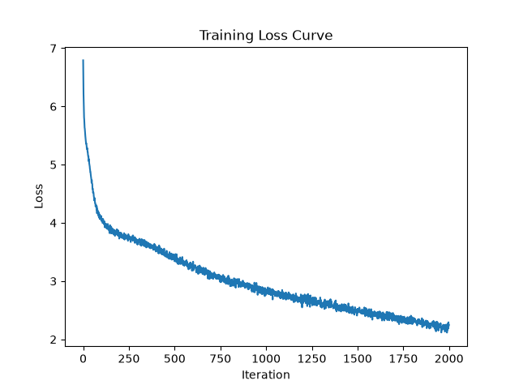

# Comparing dif activation functions & their performance

Comparing RELU, SwiGLU, and GELU activation functions in the feedforward layers of the transformer architecture. For SwiGLU, I'm going to scale down the feedforward size by 2/3 to reduce FLOPs, which is a common practice when using SwiGLU.

## Hypothesis
- Based on computational intensity, ReLU will be fastest, then GELU, then SwiGLU. SwiGLU is a lot more computationally intensive since it involves whole matrix multiplications and is more memory intensive.
- That being said, SwiGLU is obviously more expressive and will likely have the best loss, followed by GELU, then ReLU.
- Even with the SwiGLU scaling, I think it will still be slower than GELU and ReLU because even if you can get it to be the same amount of FLOPs, it will still have more memory overhead.

## Method

All hyperparameters are kept stagnant. I'm using the same model as used in RMSNorm experiments (implementing RMSNorm, removing bias from all linear layers, and now making sure to compile the whole model instead of just RMSnorm layers). This is also the same baseline I'm using with ReLU.

## Results summary

| Activation | Best Train Loss | Best Val Loss | Best Val BPB | Step @ Best Val | Final Val Loss (step 2000) | Avg ms/iter (steps 200–2000) |
|---|---|---|---|---|---|---|
| ReLU       | 2.0955 | 3.1436 | 2.1533 | 1400 | 3.1960 | ~499 |
| GELU       | 1.8924 | 3.1518 | 2.1589 | 1400 | 3.2748 | ~499 |
| SwiGLU (2/3 scaled) | 1.6159 | 3.1683 | 2.1702 | 1200 | 3.4379 | ~505 |

## Analysis
- ReLU and GELU perform nearly identically in best val loss, speed, and step # for best val loss. However, the final val loss for GELU is worse than ReLU, and train loss is significantly better.
- SwiGLU is slower than both ReLU and GELU as I expected, but not significantly. This makes sense because the dimension was scaled down to have the same FLOPs as GELU. It is possible that the memory overhead of SwiGLU is what is causing it to be slower than GELU, even though they have the same FLOPs. Additionally, SwiGLU has the best training loss by a landslide.
- Both GELU and SwiGLU have significantly improved training losses yet worse final validation losses and similar best validation losses to ReLU. This is a very likely sign of overfitting. It's also worth noting that SwiGLU starts overfitting earlier (step 1200) than GELU/RELU (step 1400).

## Next steps
My hypothesis for why the overfitting is so severe is that model is too small considering how big the dataset is. This reminds me of Chinchilla scaling laws; the model is either too large for the dataset or the dataset is too small for the model.
- Parameters: 11,300,736 (11.30M)
- Training tokens: 32,768,000 (32.77M)
- Tokens/parameter: 2.90

This is a very low tokens/parameter ratio, especially compared to Chinchilla's optimal 20 tokens/parameter ratio. This is likely the reason for the overfitting, and it makes sense that the more expressive GELU and SwiGLU activations are overfitting more than ReLU since they add complexity. I'm investigating this in `experimentation/overfitting.md`.

## Raw results

**ReLU**
```
using MPS
chars-per-token: train: 2.2338, val: 2.1062
step 1: train loss 6.3381, val loss 6.3183, val bpb 4.3279, ms/iter 1624.91
step 200: train loss 3.8005, val loss 3.9533, val bpb 2.7079, ms/iter 504.23
step 400: train loss 3.5579, val loss 3.7665, val bpb 2.5800, ms/iter 497.32
step 600: train loss 3.2432, val loss 3.5305, val bpb 2.4183, ms/iter 495.57
step 800: train loss 2.9762, val loss 3.3322, val bpb 2.2825, ms/iter 500.29
step 1000: train loss 2.7789, val loss 3.2207, val bpb 2.2061, ms/iter 499.71
step 1200: train loss 2.6306, val loss 3.1829, val bpb 2.1802, ms/iter 498.11
step 1400: train loss 2.4850, val loss 3.1436, val bpb 2.1533, ms/iter 497.94
step 1600: train loss 2.3584, val loss 3.1529, val bpb 2.1597, ms/iter 502.97
step 1800: train loss 2.2239, val loss 3.1552, val bpb 2.1612, ms/iter 498.33
step 2000: train loss 2.0955, val loss 3.1960, val bpb 2.1892, ms/iter 493.53
```


**Sample output:**

```
indessels shall be of them: O we are
For the rotten will be brought to't.

LUCIONow, if you a dream but wrong'd by and
I can be coft you:.
Becess base common night aptony the issuey,
usout my serves known to is; but,
To peathering you, sir, and all the offends is else a ract,
To look such obellients
aughter, nor an English fair peace, made Volscary. Go, pitifult!
From all the house
Down still the tokeness of Tower; but mine being
The ros of the greater right to put upon its to come
Against out. He myself upon the door.

AULINIUS:
Is all a stay suffer man. I stabelsing of sens;
And feebly 'em, but with him who few-stramk'd--
The noon food of's son, wherein the hope with their bleing
And for it like against him crave hourses!

ARCUS:
Gentle Paris, to the jewel it did enough him:
Susld forendeavour hath he made me found.

Shepherd:
More deed, and made it even now.

Gentleman:
You walk of mark of the people!

First Lord:
Sce� humble prat and honour,
Mathe estimities and lay about
I' the tdwents to see an unkined boin'd hand,
With blown execution.
The bridue-buffact of a wed strength and earth king's face,
And
```

**GELU**
```
using MPS
chars-per-token: train: 2.2338, val: 2.1062
step 1: train loss 6.4650, val loss 6.4483, val bpb 4.4170, ms/iter 1526.10
step 200: train loss 3.7777, val loss 3.9305, val bpb 2.6923, ms/iter 506.19
step 400: train loss 3.5005, val loss 3.7310, val bpb 2.5557, ms/iter 508.81
step 600: train loss 3.1543, val loss 3.4626, val bpb 2.3718, ms/iter 499.12
step 800: train loss 2.8911, val loss 3.2905, val bpb 2.2539, ms/iter 495.11
step 1000: train loss 2.6877, val loss 3.1936, val bpb 2.1876, ms/iter 495.76
step 1200: train loss 2.5249, val loss 3.1788, val bpb 2.1774, ms/iter 495.74
step 1400: train loss 2.3630, val loss 3.1518, val bpb 2.1589, ms/iter 495.21
step 1600: train loss 2.2121, val loss 3.1859, val bpb 2.1823, ms/iter 496.98
step 1800: train loss 2.0547, val loss 3.2123, val bpb 2.2004, ms/iter 498.75
step 2000: train loss 1.8924, val loss 3.2748, val bpb 2.2432, ms/iter 498.89
```



**Sample output:**

```
athed lodged as herdvers her pince�loys.

QUEEN ELIET:
What is your doom? thise on her here?

Messenger:
The young The city scarce.
Bring bids not for none.

QUEEN ELIZABETH: to woe for it.

KING RICHARD III:
Ay, with all my heart with you. Farewell;
Poor hish us the king; and we'll a short in
The which shall set our face of you.

KING RICHARD III:
Sumble I o'clvious God, be the king's father.

QUEEN ELIZABETH:
And long as happy grave?
To cheer thee out a surfeiting-tof my physiciet,
Righting on my babling death's life;
What sure art thou hast afford a thousand foot stablesting of sorrow;
And yet I sent to be a humblee
And bore-boy! all this I will pupt fight to's son
To back? Worough I stir
To thee like a later too, as it were, I rather pay with thee.

QUEEN ELIZABETH:
And state, in all trade thy husband's avoid of I'll crest;
And leave thy mempappetite,
Are comes as weep vengeance; in wanting up my gorse,
That no holy seeing everyery tender eye
He learn and honour, their natures to help and dangers.

KING RICHARD III:
Now fair, do I; those I come, that know our parts,
Will be after grief, and weep their tidings stone
While we wear the walls: in
```

**SwiGLU**
```
step 1: train loss 6.6678, val loss 6.6633, val bpb 4.5643, ms/iter 9311.58
step 200: train loss 3.7475, val loss 3.9034, val bpb 2.6738, ms/iter 542.66
step 400: train loss 3.4763, val loss 3.7081, val bpb 2.5400, ms/iter 505.43
step 600: train loss 3.0890, val loss 3.4303, val bpb 2.3497, ms/iter 496.54
step 800: train loss 2.7878, val loss 3.2395, val bpb 2.2190, ms/iter 501.34
step 1000: train loss 2.5684, val loss 3.1736, val bpb 2.1739, ms/iter 501.47
step 1200: train loss 2.3878, val loss 3.1683, val bpb 2.1702, ms/iter 496.84
step 1400: train loss 2.1989, val loss 3.1852, val bpb 2.1818, ms/iter 496.49
step 1600: train loss 2.0142, val loss 3.2561, val bpb 2.2304, ms/iter 502.05
step 1800: train loss 1.8131, val loss 3.3246, val bpb 2.2773, ms/iter 503.89
step 2000: train loss 1.6159, val loss 3.4379, val bpb 2.3549, ms/iter 501.07
```


**Sample output:**

```
loved to heaven!

Lord:
For this head I was read quickly speak'd my husband's throat,
And dreamt itle to Burathaclingham and his young.
Be you batl and forward bid her prequaint you now,
Like much the flight of this is but nightly lasting
At high disgrace and call herorsets meant.
To look on foe, marry intaughter,
Which would be a kingding forward kings, and methinks old Gaunt myself,
Look on my father to his keep
And hither behase, with my gage to-morrow mine;
Shall for revenge his limbs it: at it;
And let him well where thou preparest not of dost.

DUKE VINCENTIO:
You have stand to do this post to-morrow as staid,
A chastisb my still and sent to-night;
And who lie as if the place is not ignorant,
Thou'st thine enemy your fellows and your fair,
And she be caused with her?

ISABELLA:
Gentle her! Go to the jewel of this face.

LUCIO:
Sondeavy hath he made wronged; twhich famed scorn:
By heaven cuts, as we are too long;
The wantons mark'd together, holy, wise, and pollow;
For humbly dead, and puts are keep with false!

DUKE VINCENTIO:
My friends dissoluteous, do fool out a weep:--Good expedge my body
Till he dwell it up, and go with stand for't;
And we are Angelo,
```