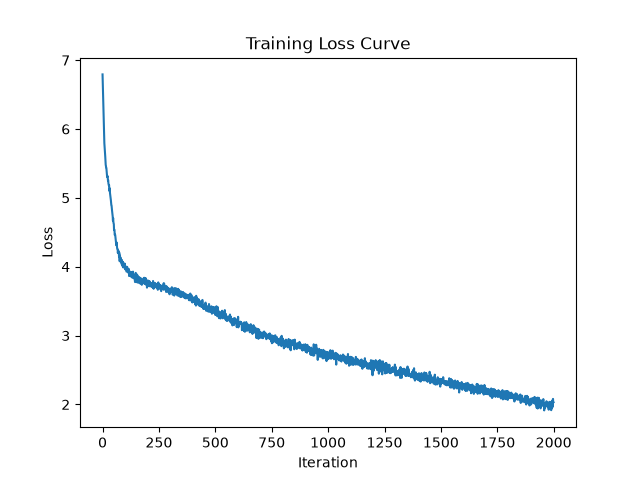
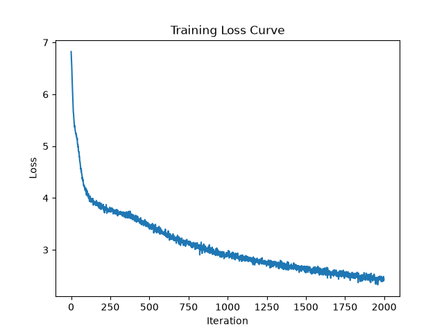
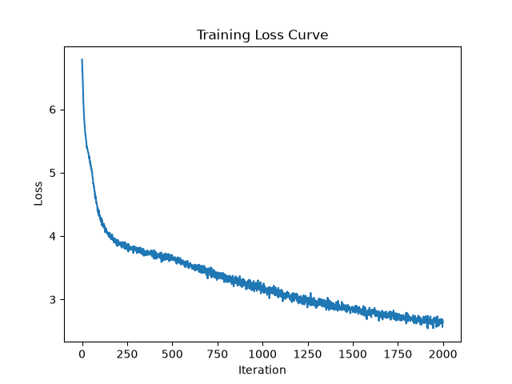
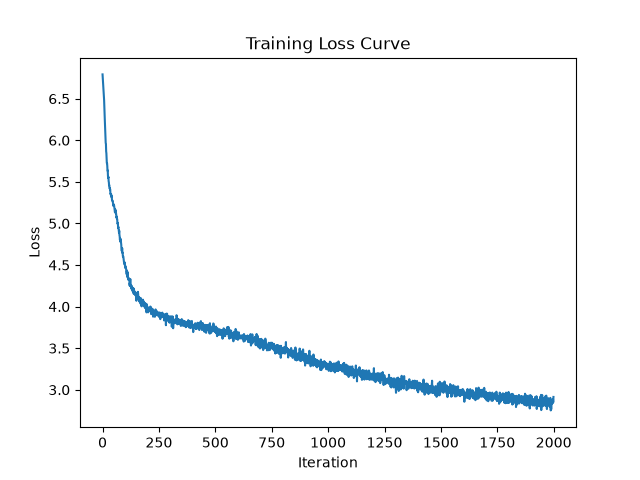
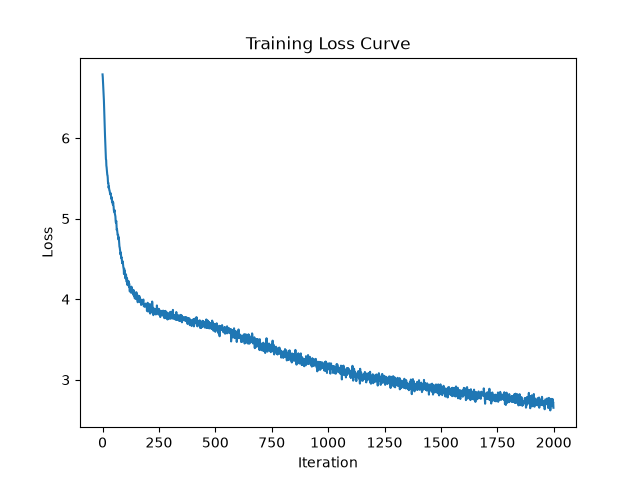
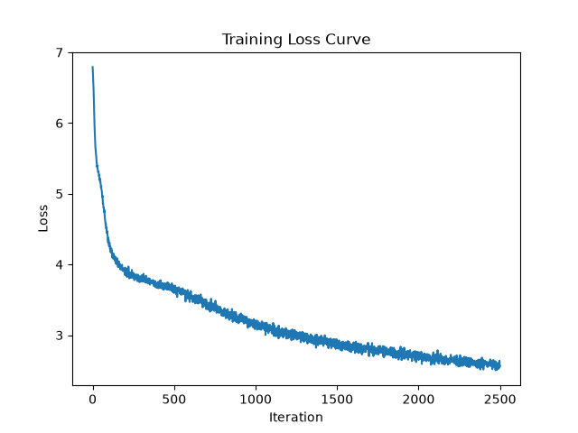

# Investigating causes for overfitting

## Hypothesis

My hypothesis for why the overfitting is so severe is that model is too small considering how big the dataset is. This reminds me of Chinchilla scaling laws; the model is either too large for the dataset or the dataset is too small for the model.
- Parameters: 11,300,736 (11.30M)
- Training tokens: 32,768,000 (32.77M)
- Tokens/parameter: 2.90

This is a very low tokens/parameter ratio, especially compared to Chinchilla's optimal 20 tokens/parameter ratio. This is likely the reason for the overfitting, and it makes sense that the more expressive GELU and SwiGLU activations are overfitting more than ReLU since they add complexity.

## Method
I'm going to run a couple different scenarios. This is the default configuration for the model:

| Hyperparameter | Value |
|---|---|
| `batch_size` | 64 |
| `block_size` | 256 |
| `max_iters` | 2000 |
| `eval_interval` | 200 |
| `learning_rate` | 3e-4 |
| `eval_iters` | 200 |
| `n_embd` | 384 |
| `n_head` | 6 |
| `n_layer` | 6 |
| `dropout` | 0.2 |

** not a hyperparameter but im going to be using SwiGLU for the feedforward activation function in this experiment

These are the changes I'm making:
1. with all other parameters held the same, reducing the number of layers from 6 to 3 and the number of heads from 6 to 3.
2. with all other parameters held the same, reducing n_embd from 384 to 256.
3. with all other parameters held the same, reducicing number of layers from 6 to 3, heads from 6 to 3, and n_embd from 384 to 256 (scenario 1 and 2 combined).

I know this isnt a perfect ablation because I'm testing multiple changes things at once, but I just want to get a general sense of what helps with reducing overfitting given time/compute constraints. To some extent, scenario 1 reduces "length", scenario 2 reduces "width", and scenario 3 does both. I can run more controlled ablations later if needed.

## Results summary

I added Scenario 4 with 3 heads and 3 layers, but n_embd = 300 (as opposed to 256 in scenario 3). This is because I noticed in scenario 2 that reducing n_embd to 256 made it converge much slower while still experiencing even more significant overfitting. I wanted to see if increasing n_embd to 300 would help with convergence and overfitting.

| Config | Params | Tokens/Param | Best Val Loss | Best Val BPB | Step @ Best | Final Train Loss | Final Val Loss | Val−Train Gap | Avg ms/iter |
|---|---|---|---|---|---|---|---|---|---|
| Benchmark (6L/6H, n_embd 384)   | 11.30M | 2.90  | 3.1683 | 2.1702 | 1200 | 1.6159 | 3.4379 | 1.8220 | ~505 |
| Scenario 1 (3L/3H)              | 5.99M  | 5.47  | 3.1397 | 2.1506 | 1600 | 2.1653 | 3.1942 | 1.0289 | ~229 |
| Scenario 2 (n_embd 256)         | 5.15M  | 6.37  | 3.1635 | 2.1669 | 2000 | 2.4443 | 3.1635 | 0.7192 | ~332 |
| Scenario 3 (3L/3H + n_embd 256) | 2.81M  | 11.66 | 3.1804 | 2.1785 | 2000 | 2.6658 | 3.1804 | 0.5146 | ~141 |
| Scenario 4 (3L/3H + n_embd 300) | 3.77M  | 8.69  | 3.1626 | 2.1664 | 2000 | 2.5005 | 3.1626 | 0.6621 | ~176 |

**Loss curves:**
| Benchmark | Scenario 1 | Scenario 2 | Scenario 3 | Scenario 4 |
|---|---|---|---|---|
|  |  |  |  |  |


## Analysis
- Scenario 1 performs the best by far, despite cutting both the number of layers and heads in half. It converges at step 1600, which is later than benchmark's best val loss. Scenarios 2 and 4 perform on par with the benchmark, but their best val loss is on the last step (2000), indicating they are still converging. 
- It seems like reducing the number of layers and heads (length of model) is doesnt affect the model performance as much as reducing the embedding size (width of model).
- Even when comparing the n_embd 256 situation with 6/6 heads/layers (benchmark) vs 3/3 heads/layers (scenario 3),they perform pretty similarly.
- The val-train gap is significantly reduced in situations where n_embd is decreased from 384, indicating that this may be where the overfitting is actually coming from.
- The drop in ms/iter is huge. There's no point training larger models that take nearly double the time if the performance payoff isn't there.
- For ALL of the models, the difference in best validation loss is actually very small. Since performance doesn't vary much for different hyperparameters, my focus should be on the other factors I can control (overfitting, convergence speed, runtime, etc.)

My takeaways for future runs is that reducing heads and layers to 3 each doesn't affect model performance much but cuts ms/iter very dramatically. As someone running these on my laptop, this is a huge win that I will be incorporating into future runs. Additionally, reducing n_embd from 384 to 256 seems to help with overfitting, but it also slows convergence. I think a good compromise is to use n_embd = 300, which is what I will be using for future runs. You can refer to the bottom of this file to see raw results for scenario 4 with 2500 iterations. It got to convergence around 2400, so Ill be using 2400 max_iter in future runs to optimize for the best val loss and no useless iterating.

I also want to caveat that none of my takeaways can really be absolute considering this wasn't a clean ablation experiment. I was testing multiple changes at once, so I can't say for sure which change is responsible for the results. However, this was a good first pass to get a general sense of what helps with overfitting and convergence speed.


## Raw results
**benchmark (no changes)**
Using the SwiGLU run from the activations experimentation.
- Parameters: 11,300,736 (11.30M)
- Training tokens: 32,768,000 (32.77M)
- Tokens/parameter: 2.90

```
step 1: train loss 6.6678, val loss 6.6633, val bpb 4.5643, ms/iter 9311.58
step 200: train loss 3.7475, val loss 3.9034, val bpb 2.6738, ms/iter 542.66
step 400: train loss 3.4763, val loss 3.7081, val bpb 2.5400, ms/iter 505.43
step 600: train loss 3.0890, val loss 3.4303, val bpb 2.3497, ms/iter 496.54
step 800: train loss 2.7878, val loss 3.2395, val bpb 2.2190, ms/iter 501.34
step 1000: train loss 2.5684, val loss 3.1736, val bpb 2.1739, ms/iter 501.47
step 1200: train loss 2.3878, val loss 3.1683, val bpb 2.1702, ms/iter 496.84
step 1400: train loss 2.1989, val loss 3.1852, val bpb 2.1818, ms/iter 496.49
step 1600: train loss 2.0142, val loss 3.2561, val bpb 2.2304, ms/iter 502.05
step 1800: train loss 1.8131, val loss 3.3246, val bpb 2.2773, ms/iter 503.89
step 2000: train loss 1.6159, val loss 3.4379, val bpb 2.3549, ms/iter 501.07
```


**Sample output:**

```
loved to heaven!

Lord:
For this head I was read quickly speak'd my husband's throat,
And dreamt itle to Burathaclingham and his young.
Be you batl and forward bid her prequaint you now,
Like much the flight of this is but nightly lasting
At high disgrace and call herorsets meant.
To look on foe, marry intaughter,
Which would be a kingding forward kings, and methinks old Gaunt myself,
Look on my father to his keep
And hither behase, with my gage to-morrow mine;
Shall for revenge his limbs it: at it;
And let him well where thou preparest not of dost.

DUKE VINCENTIO:
You have stand to do this post to-morrow as staid,
A chastisb my still and sent to-night;
And who lie as if the place is not ignorant,
Thou'st thine enemy your fellows and your fair,
And she be caused with her?

ISABELLA:
Gentle her! Go to the jewel of this face.

LUCIO:
Sondeavy hath he made wronged; twhich famed scorn:
By heaven cuts, as we are too long;
The wantons mark'd together, holy, wise, and pollow;
For humbly dead, and puts are keep with false!

DUKE VINCENTIO:
My friends dissoluteous, do fool out a weep:--Good expedge my body
Till he dwell it up, and go with stand for't;
And we are Angelo,
```

**Scenario 1: Reduced layers and heads**
```
using MPS
chars-per-token: train: 2.2338, val: 2.1062
Parameters: 5,990,016 (5.99M)
Training tokens: 32,768,000 (32.77M)
Tokens/parameter: 5.47
W0802 00:13:23.330000 84046 .venv/lib/python3.13/site-packages/torch/_inductor/utils.py:1953] [0/0] Not enough SMs to use max_autotune_gemm mode
step 1: train loss 6.7514, val loss 6.7444, val bpb 4.6198, ms/iter 3459.20
step 200: train loss 3.7893, val loss 3.9422, val bpb 2.7003, ms/iter 242.36
step 400: train loss 3.5753, val loss 3.7631, val bpb 2.5776, ms/iter 225.04
step 600: train loss 3.2017, val loss 3.4664, val bpb 2.3744, ms/iter 228.51
step 800: train loss 2.9370, val loss 3.2896, val bpb 2.2533, ms/iter 224.81
step 1000: train loss 2.7582, val loss 3.1973, val bpb 2.1901, ms/iter 230.62
step 1200: train loss 2.6108, val loss 3.1646, val bpb 2.1677, ms/iter 227.13
step 1400: train loss 2.4928, val loss 3.1451, val bpb 2.1543, ms/iter 230.65
step 1600: train loss 2.3842, val loss 3.1397, val bpb 2.1506, ms/iter 226.70
step 1800: train loss 2.2675, val loss 3.1640, val bpb 2.1673, ms/iter 226.29
step 2000: train loss 2.1653, val loss 3.1942, val bpb 2.1880, ms/iter 224.98
```


**Sample output:**

```
the devil's deool:
She hath cior Hortensio, friends and bad life
The invillout all untrived,
Hath been more best, little cunning and ne'er he a friend,
Hears will make it stand. Go, come. What thinkful march:
Think I, that the tidings are gull;
And but it is hard in this of curst;
Such as York; give him i' the nobly proferial law.

HOMASTINGS:
Nor I nor thus a gentleman?

GLOUCESTER:
This is consent of the Bretant's daughter:
Tell him, good Montague
Such for my words; here's head, kindness folds my noble traitor!
The Volsces on the lead
Which now you degree tiger's. What is't your lord?

HENRY BOLINGBROKE:
Therefore so!

GLOUCESTER:
Send to be done, and in love of him and
The son is seleon-forth and till he fell of my life,
The son, which soldren are groses
For great tidings oft place; 'tis not thy name.

Provost:
Grace me be a gentleman of King Camillo,
And, being bliss the debase
Madam, with a bark,
And cen stony, Keeper, uncle, brawling: then else our cast,
I must be dead that he is strupt.

GLOUCESTER:
But dress'd villain, to pall him back my guits
Thy father and wastef princely slipp'd.

Girl.

GLOUCESTER:
I do know.
```


**Scenario 2: Reduced block size and n_embd**
```
using MPS
chars-per-token: train: 2.2338, val: 2.1062
Parameters: 5,146,880 (5.15M)
Training tokens: 32,768,000 (32.77M)
Tokens/parameter: 6.37
step 1: train loss 6.7112, val loss 6.7100, val bpb 4.5963, ms/iter 1517.60
step 200: train loss 3.8644, val loss 3.9997, val bpb 2.7397, ms/iter 332.55
step 400: train loss 3.6826, val loss 3.8529, val bpb 2.6392, ms/iter 333.61
step 600: train loss 3.4727, val loss 3.6867, val bpb 2.5254, ms/iter 333.04
step 800: train loss 3.2558, val loss 3.5380, val bpb 2.4235, ms/iter 336.43
step 1000: train loss 3.0507, val loss 3.4018, val bpb 2.3302, ms/iter 322.49
step 1200: train loss 2.8847, val loss 3.2947, val bpb 2.2568, ms/iter 329.31
step 1400: train loss 2.7495, val loss 3.2370, val bpb 2.2173, ms/iter 328.24
step 1600: train loss 2.6352, val loss 3.1933, val bpb 2.1874, ms/iter 333.27
step 1800: train loss 2.5317, val loss 3.1757, val bpb 2.1753, ms/iter 334.12
step 2000: train loss 2.4443, val loss 3.1635, val bpb 2.1669, ms/iter 333.99
```


**Sample output:**

```
art, who little pointen Froth
Or is up; for I have an exedue.

KING LEWIS XI:
O Buckingham in, and with'tumeds them out on
Abold, all the rooyses of miser
In labour in an mind envied.

KING HENRY VI:
How now have they teliedly will need it stay.

GLOUCESTER:
Nay, but for this is Dorsemberland?
When scarced this, girl.
My lord, I should do't not her a Warewick Monto?

KING HENRY VI:
O God that hand but true obschange unto this little.

YORK:
'Tis still his land so good at name from the outguast.

KING HENRY VI:
Watch your troop, a most exsolve wars
A husband' what drown loves all his brother Edwardld's land,
But, the true frame is the crown?
Tituch your chardent, thy revenge!

YORK:
That is deficion'd in heir to thee much.
Wherefore, say that I was plained;
They were fair blasting's night will I hear;
I will I ask me in surposom'd or digm.

PRINCE EDWARD:
That unto you not on my sonsom!
They'er him, and, with entert? and Mowbray!

Second Message:
Poor Messenio, and I abound;
Whateove gentleman, mistress
Your still, were you that high cells what to your according?

WARWICK:
Than when he that a word, of--
```


**Scenario 3: Reduced layers, heads, block size, and n_embd**
```
using MPS
chars-per-token: train: 2.2338, val: 2.1062
Parameters: 2,809,088 (2.81M)
Training tokens: 32,768,000 (32.77M)
Tokens/parameter: 11.66
W0802 00:53:42.623000 87240 .venv/lib/python3.13/site-packages/torch/_inductor/utils.py:1953] [0/0] Not enough SMs to use max_autotune_gemm mode
step 1: train loss 6.7491, val loss 6.7381, val bpb 4.6155, ms/iter 3585.61
step 200: train loss 3.9381, val loss 4.0513, val bpb 2.7751, ms/iter 154.61
step 400: train loss 3.7404, val loss 3.8799, val bpb 2.6576, ms/iter 138.59
step 600: train loss 3.5892, val loss 3.7846, val bpb 2.5924, ms/iter 139.91
step 800: train loss 3.3921, val loss 3.6226, val bpb 2.4814, ms/iter 138.96
step 1000: train loss 3.1869, val loss 3.4763, val bpb 2.3812, ms/iter 138.63
step 1200: train loss 3.0272, val loss 3.3578, val bpb 2.3000, ms/iter 140.82
step 1400: train loss 2.9022, val loss 3.2856, val bpb 2.2506, ms/iter 141.51
step 1600: train loss 2.8105, val loss 3.2279, val bpb 2.2110, ms/iter 140.01
step 1800: train loss 2.7354, val loss 3.2009, val bpb 2.1926, ms/iter 137.46
step 2000: train loss 2.6658, val loss 3.1804, val bpb 2.1785, ms/iter 134.61
```


**Sample output:**

```
entle his son Edward's guilty?
Flray the lawful kingdom of glass'd king!

Stafe and cloubred of widastast!
DORSET:
Say thou hast thy most grave thee, scicken:
Here lie will none, but came,
Go, this rest of Walm,
As they flower witRY on sching waged, pursush our three waging resolved undermures,
And only in coal weep as sweat
A long again.

Shall HENRY VITA:
Came me bound' murder me.
Such her, nor enflecting?

BALTUS:
Had no one that thou hast woman: pity.

CORIOLANUS:
Came it to bad?

BENVOLIONNE:
I neither not be honour out with death. Who
Grace: you know it,Very, I will
That good they were this
Rome. You are fled.
I go, farew your trifather!

By promised.
Gentleman:
Sith Capherd drinking it to my tazing, without bark and honourach
Thou do yare not be kill your son, mid.

Besides, gentlem and what ampr'd what! if that I have not have lefted; besuge same in the laid
Susm of her breathing
wary to know the poison; calladasave
be joint meng,
Doth with facont: fled afflets are smen!
Make these first dear friends, Ned me wakeedience,
As hely; fives of yoursly fal
```

**Scenario 4: scenario 3 except with n_embd 300 not 256**
```
using MPS
chars-per-token: train: 2.2338, val: 2.1062
Parameters: 3,772,500 (3.77M)
Training tokens: 32,768,000 (32.77M)
Tokens/parameter: 8.69
W0802 01:26:43.750000 89741 .venv/lib/python3.13/site-packages/torch/_inductor/utils.py:1953] [0/0] Not enough SMs to use max_autotune_gemm mode
step 1: train loss 6.7490, val loss 6.7475, val bpb 4.6219, ms/iter 3842.12
step 200: train loss 3.8715, val loss 3.9973, val bpb 2.7381, ms/iter 185.87
step 400: train loss 3.6784, val loss 3.8503, val bpb 2.6374, ms/iter 171.05
step 600: train loss 3.4843, val loss 3.7053, val bpb 2.5381, ms/iter 170.88
step 800: train loss 3.2260, val loss 3.4801, val bpb 2.3838, ms/iter 170.77
step 1000: train loss 3.0128, val loss 3.3401, val bpb 2.2879, ms/iter 169.40
step 1200: train loss 2.8737, val loss 3.2544, val bpb 2.2292, ms/iter 177.36
step 1400: train loss 2.7562, val loss 3.2075, val bpb 2.1971, ms/iter 181.24
step 1600: train loss 2.6596, val loss 3.1861, val bpb 2.1824, ms/iter 179.02
step 1800: train loss 2.5772, val loss 3.1682, val bpb 2.1702, ms/iter 177.18
step 2000: train loss 2.5005, val loss 3.1626, val bpb 2.1664, ms/iter 179.73
```


**Sample output:**

```
on 'This children,
Unto his weal that partrush, my brother,
To the tears of fair right, and now!
Should not thou dost lost--
We sounds in this time, there thy sight not
When thou lit rather wrath if he live

EDWARD:
Welcompless blame he in the way, hence proud to crown, or fly. If thou hear the way
To be What ere he beholders news:
Even-morse of his men's sound.

YORK:
Tan sk you, and save a duty.

WARWICK:
He shall not he that then may have indelt.

WARWICK:
What superined whose cl sovereign an enemy? had the though it stands.

CLARENCE:
Ay, I see, anon that I did unless sort,
I dust, LAUnmasters, died.

Rarmixt's affector Henry, cunning folly
More than Juliet gentlemen would have praised us:
Thouurd, for his news and waging, and thrifused
Delent to part from his lelb of death.

MONTAGUE:
Breathed his countsague is sweet bowh in blood and sun-like,
God save the rest.

KING EDWARD IV:
Please I paunt that Edward's friend, discharged ours.

WARWICK:

CLIFK:
'Tis Duke of Norfolk, are deputy against.

First Watchman:

KING EDWARD IVetch king:
```

**Scenario 3 with 2500 runs**
```
using MPS
chars-per-token: train: 2.2338, val: 2.1062
Parameters: 3,772,500 (3.77M)
Training tokens: 40,960,000 (40.96M)
Tokens/parameter: 10.86
step 1: train loss 6.7490, val loss 6.7475, val bpb 4.6219, ms/iter 2311.22
step 200: train loss 3.8715, val loss 3.9973, val bpb 2.7381, ms/iter 182.52
step 400: train loss 3.6784, val loss 3.8503, val bpb 2.6374, ms/iter 172.52
step 600: train loss 3.4843, val loss 3.7053, val bpb 2.5381, ms/iter 168.88
step 800: train loss 3.2260, val loss 3.4801, val bpb 2.3838, ms/iter 168.89
step 1000: train loss 3.0128, val loss 3.3401, val bpb 2.2879, ms/iter 168.60
step 1200: train loss 2.8737, val loss 3.2544, val bpb 2.2292, ms/iter 168.56
step 1400: train loss 2.7562, val loss 3.2075, val bpb 2.1971, ms/iter 169.82
step 1600: train loss 2.6596, val loss 3.1861, val bpb 2.1824, ms/iter 168.42
step 1800: train loss 2.5772, val loss 3.1682, val bpb 2.1702, ms/iter 168.30
step 2000: train loss 2.5005, val loss 3.1626, val bpb 2.1664, ms/iter 168.38
step 2200: train loss 2.4291, val loss 3.1623, val bpb 2.1661, ms/iter 168.15
step 2400: train loss 2.3653, val loss 3.1492, val bpb 2.1571, ms/iter 168.38
step 2500: train loss 2.3247, val loss 3.1566, val bpb 2.1622, ms/iter 168.36
```



**Sample output:**

```
est thou soest thy kes; kiss where, king,
Not fearing thy doom I shawed my shame.
In thy deep soul to me, reazy,
And that thy sweet dutinous word come to tide to thy mind;
Long wrecking in thy creices shoud,
Topplieve thy crowns are bound again.

DUCHESS OF YORK:
Should I tell my exterord! alas the wards of the hord!
I'll fram thee in my foes,
And sail thee weeds and are thy soverew
Did they see
To bear a thousand spring thee in to't?
What, holy married. How like another?
O, by the fault was secrute,
Make not, durst not men:--moans me but: and
To Buckingham
It truth of that had showl and the words
That want for anyrant house, seld what's bethens death;
Here thrust this earth to dead, and his foot,
For that fair beast, do answer's head
More than he will sent for this war, but a fellow, as if he him with
Show-bear'd; I say, knees, he'll bold, friar, nor safe seven run lord spased
To prove his uringe assunate paulteen traitors,
Not shall be subdues to time have evers me to a valus.
I every wrong; and suppery well some city
When your honour, good Capulet or with other pious territo.

Second Ser:
Sir, and let it.

MISABELLA:
Take him as you, but so, he
```