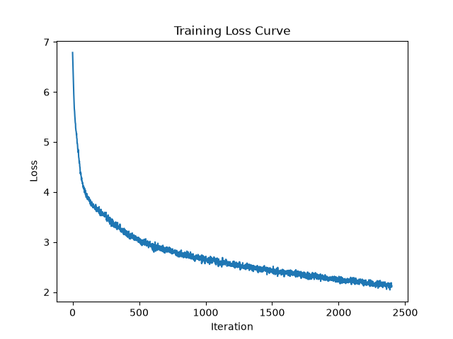
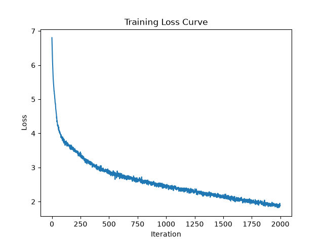

# Absolute positional embeddings vs RoPE ablation

## Hypothesis

- RoPE encodes relative position directly into the attention computation, giving the model a stronger inductive bias than learned absolute positional embeddings. I predict this will improve generalization, leading to a lower validation loss or reaching the best validation loss in fewer training iterations.
- Because RoPE provides positional structure from the start rather than requiring the model to learn it through embeddings, I expect it to reach its best validation performance earlier in training. Since the model might converge faster, overfitting might begin earlier, worsening fina val loss. Hence, I need to look at best val loss and step at which it was achieved, as well.
- RoPE will likely have higher ms/iter because of the additional computation from rotating k and q. However, I predict that it will converge faster and require less iterations in total, so the optimal total training time will be less than absolute positional embeddings.


## Method
I'm keeping all the below hyperparameters constant and running two experimennts: one with absolute positional embeddings and one with RoPE. The hyperparameters are:

| Hyperparameter | Value |
|---|---|
| `batch_size` | 64 |
| `block_size` | 256 |
| `max_iters` | 2400 |
| `eval_interval` | 200 |
| `learning_rate` | 3e-4 |
| `eval_iters` | 200 |
| `n_embd` | 300 |
| `n_head` | 3 |
| `n_layer` | 3 |
| `dropout` | 0.2 |

## Results summary
| Config | Params | Tokens/Param | Best Val Loss | Best Val BPB | Step @ Best | Train Loss @ Best | Val−Train Gap @ Best | Final Val Loss | Final Train Loss | Avg ms/iter |
|---|---|---|---|---|---|---|---|---|---|---|
| Absolute PosEmb | 3.77M | 10.86 | 3.1492 | 2.1571 | 2400 | 2.3653 | 0.7839 | 3.1492 | 2.3653 | ~169 |
| RoPE            | 3.70M | 10.64 | 3.1387 | 2.1500 | 1000 | 2.4596 | 0.6791 | 3.4119 | 1.7203 | ~178 |

| Absolute Positional Embeddings | RoPE |
|---|---|
|  |  |

## Analysis
- RoPE beats absolute positional embeddings in terms of best validation loss (3.1387 vs 3.1492), and reaches that point significantly earlier (step 1000 vs step 2400). This supports my hypothesis that RoPE provides a stronger inductive bias and allows the model to converge faster.
- RoPE has a smaller gap between train and validation loss at the point of best validation loss (0.6791 vs 0.7839), which suggests that it generalizes better than absolute positional embeddings and helps with overfitting to some extent.
- RoPE's final val loss is worse than absolute positional embeddings (3.4119 vs 3.1492). Looking at the val losses every 200 steps, RoPE's val loss starts to increase after step 1000. At that point, it's likely that the overfitting starts to detriment the model's performance, which is consistent with my hypothesis that RoPE starts to overfit earlier.
- On the other hand, the final training loss for RoPE is significantly lower than absolute positional embeddings (1.7203 vs 2.3653). This is also comparable to the best models I've trained in other experiments of this, despite having used less heads, layers, and n_embd in this experiment. This suggests that RoPE is able to fit the training data significantly better.
- As expected, RoPE is slightly slower per iteration than absolute positional embeddings (~178 ms/iter vs ~169 ms/iter), but it reached it's best validation loss in 1000 iterations as opposed to 2400, so the total training time to reach best validation loss is significantly less for RoPE.

Overall, RoPE clearly has insane potential and has improved this model significantly. I'm going to bring the n_embd back up to 384 and iterations down to 2000 for a final run to determine what the best parameters to use for future runs are. (See bottom of this doc for raw results)

## Raw results
**Absolute positional embeddings**
```
using MPS
chars-per-token: train: 2.2338, val: 2.1062
Parameters: 3,772,500 (3.77M)
Training tokens: 40,960,000 (40.96M)
Tokens/parameter: 10.86
step 1: train loss 6.7490, val loss 6.7475, val bpb 4.6219, ms/iter 2311.22
step 200: train loss 3.8715, val loss 3.9973, val bpb 2.7381, ms/iter 182.52
step 400: train loss 3.6784, val loss 3.8503, val bpb 2.6374, ms/iter 172.52
step 600: train loss 3.4843, val loss 3.7053, val bpb 2.5381, ms/iter 168.88
step 800: train loss 3.2260, val loss 3.4801, val bpb 2.3838, ms/iter 168.89
step 1000: train loss 3.0128, val loss 3.3401, val bpb 2.2879, ms/iter 168.60
step 1200: train loss 2.8737, val loss 3.2544, val bpb 2.2292, ms/iter 168.56
step 1400: train loss 2.7562, val loss 3.2075, val bpb 2.1971, ms/iter 169.82
step 1600: train loss 2.6596, val loss 3.1861, val bpb 2.1824, ms/iter 168.42
step 1800: train loss 2.5772, val loss 3.1682, val bpb 2.1702, ms/iter 168.30
step 2000: train loss 2.5005, val loss 3.1626, val bpb 2.1664, ms/iter 168.38
step 2200: train loss 2.4291, val loss 3.1623, val bpb 2.1661, ms/iter 168.15
step 2400: train loss 2.3653, val loss 3.1492, val bpb 2.1571, ms/iter 168.38
```


**Sample output:**

```
est thou soest thy kes; kiss where, king,
Not fearing thy doom I shawed my shame.
In thy deep soul to me, reazy,
And that thy sweet dutinous word come to tide to thy mind;
Long wrecking in thy creices shoud,
Topplieve thy crowns are bound again.

DUCHESS OF YORK:
Should I tell my exterord! alas the wards of the hord!
I'll fram thee in my foes,
And sail thee weeds and are thy soverew
Did they see
To bear a thousand spring thee in to't?
What, holy married. How like another?
O, by the fault was secrute,
Make not, durst not men:--moans me but: and
To Buckingham
It truth of that had showl and the words
That want for anyrant house, seld what's bethens death;
Here thrust this earth to dead, and his foot,
For that fair beast, do answer's head
More than he will sent for this war, but a fellow, as if he him with
Show-bear'd; I say, knees, he'll bold, friar, nor safe seven run lord spased
To prove his uringe assunate paulteen traitors,
Not shall be subdues to time have evers me to a valus.
I every wrong; and suppery well some city
When your honour, good Capulet or with other pious territo.

Second Ser:
Sir, and let it.

MISABELLA:
Take him as you, but so, he
```

**RoPE positional embeddings**
```
using MPS
chars-per-token: train: 2.2338, val: 2.1062
Parameters: 3,695,700 (3.70M)
Training tokens: 39,321,600 (39.32M)
Tokens/parameter: 10.64

step 1: train loss 6.6857, val loss 6.6838, val bpb 4.5783, ms/iter 6166.84
step 200: train loss 3.5583, val loss 3.7036, val bpb 2.5369, ms/iter 207.90
step 400: train loss 3.0607, val loss 3.3685, val bpb 2.3074, ms/iter 177.32
step 600: train loss 2.7781, val loss 3.1950, val bpb 2.1885, ms/iter 178.82
step 800: train loss 2.6013, val loss 3.1704, val bpb 2.1717, ms/iter 178.24
step 1000: train loss 2.4596, val loss 3.1387, val bpb 2.1500, ms/iter 177.54
step 1200: train loss 2.3422, val loss 3.1529, val bpb 2.1597, ms/iter 177.64
step 1400: train loss 2.2253, val loss 3.1918, val bpb 2.1864, ms/iter 175.66
step 1600: train loss 2.1147, val loss 3.2159, val bpb 2.2028, ms/iter 176.94
step 1800: train loss 2.0054, val loss 3.2601, val bpb 2.2331, ms/iter 177.57
step 2000: train loss 1.9109, val loss 3.3008, val bpb 2.2610, ms/iter 177.19
step 2200: train loss 1.8113, val loss 3.3523, val bpb 2.2963, ms/iter 176.38
step 2400: train loss 1.7203, val loss 3.4119, val bpb 2.3371, ms/iter 175.19
```


**Sample output:**

```
this is the face
In Volsces with weeping-shakens. Speak, trees, other
Blown and prince. He cry it makes comfort.

ROMEO:
Then, so it found with him. Speer wherein my name word;
And thus we put us forpe the swecting it.

Nurse:
A thousand fantast's wonder thy care, that make thee most
Be serve to whom until but first beggar ladies!
O be the sun. O, he's dog is a part in this,
Sound like a trick.
Yet, it, for a part honest day by our excures,
Quoin too noble and their strength
Take himself weeps all account. This foe,
May we hear and let him be here. Yes the secret,
Where it would be married as flag is get, I am a
ffected in princes hides.

SICINIUS:
Thisgue that even I the general.

MARCIUS:
Marcius.

VOLUMNIA:
Ay, as you are, if you sing, we do reward:
Let us sit upon you that do him good up.

VOLUMNIA:
Sir, they repenti, sir, as I hear the more it of that
I'd from married at the escape.

BIOND day:
Here let us back to make good time anon's gift
Like us in peace. Come, now what need it is.
3 KING HENRY VI

CORIOLANUS:
More potens?

CORIOLANUS:
Most mettledges of any heavy tearing,
What
```

**RoPE round 2**
```
using MPS
chars-per-token: train: 2.2338, val: 2.1062
Parameters: 5,891,712 (5.89M)
Training tokens: 32,768,000 (32.77M)
Tokens/parameter: 5.56
W0802 17:53:06.378000 22386 .venv/lib/python3.13/site-packages/torch/_inductor/utils.py:1953] [0/0] Not enough SMs to use max_autotune_gemm mode
step 1: train loss 6.6629, val loss 6.6572, val bpb 4.5601, ms/iter 6837.20
step 200: train loss 3.4378, val loss 3.6264, val bpb 2.4841, ms/iter 267.24
step 400: train loss 2.8794, val loss 3.2456, val bpb 2.2232, ms/iter 234.56
step 600: train loss 2.6033, val loss 3.1367, val bpb 2.1486, ms/iter 241.67
step 800: train loss 2.3967, val loss 3.1248, val bpb 2.1404, ms/iter 238.12
step 1000: train loss 2.2253, val loss 3.1623, val bpb 2.1661, ms/iter 242.70
step 1200: train loss 2.0425, val loss 3.2149, val bpb 2.2022, ms/iter 237.05
step 1400: train loss 1.8698, val loss 3.2878, val bpb 2.2521, ms/iter 233.99
step 1600: train loss 1.7023, val loss 3.3828, val bpb 2.3172, ms/iter 233.75
step 1800: train loss 1.5410, val loss 3.4680, val bpb 2.3755, ms/iter 234.46
step 2000: train loss 1.3841, val loss 3.5812, val bpb 2.4531, ms/iter 234.02
```



**Sample output:**

```
Whiche uns on devotions,
Since last bound so!vierate since as pier than increase
As like as desperate line of honour fanation
If you for all, turn the gently held:
Let nor it shall penite to the obsequies,
Not sitless charge the like thee an exile;
And therefore it be hanged in this lady,
Accompasion of; that thou dost give good me
For what I may betwa for the night-wellowl;
I'll be the mans unevening, and farewell.
This are about me a short delires?
Thou wast back no war safet batter Henry for what they
s dear and his power establest noble
Sicilily, if I repove the world.

HORTENSIO:
I know. Tell me, lord?

HORTENSIO:
A man send me so, so far and to commander.
Your vengeance and your stands: towards Lift me
The pebeys seem to my soul sovereign,
Thinknily gave us all in hopes to much,
To suffering affluousness,
But in the entreaty rid of the rest,
And then could, be it blasted friends, to Bristolingbroke
About her c Oxford, her pains,
And for her names: 'Whatep ugrudget,
I must be king, that with author of his broken.

MONTAGUE:
No? can you reproise the sovereign,
And so it ended, nor of servant nail,
'Tis lesser than
```