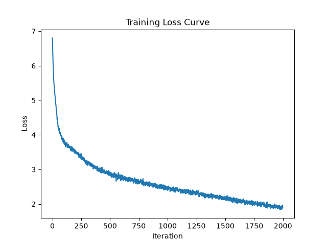
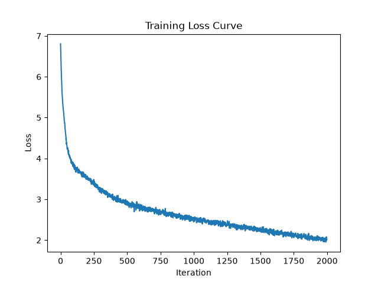
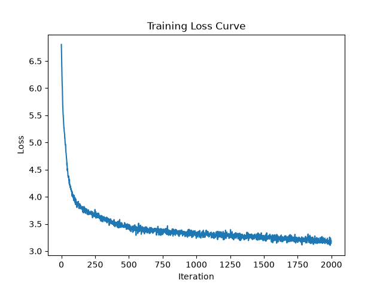

# Trying different weight decay values

I've been using AdamW without actually having any weight decay which has been a bit counterintuitive. Not to mention, I have a pretty severe overfitting problem that I'm hoping weight decay can help with. So, here I'm going to try out a few different weight decay values to see how it affects the model's performance.

## Method
I'm keeping all parameters at the same values as shown below. I'm going to stick with 2000 iterations even though the model converges much earlier, just so I can observe how the overfitting behavior changes across many iterations with the different weight decays. 

| Hyperparameter | Value |
|---|---|
| `batch_size` | 64 |
| `block_size` | 256 |
| `max_iters` | 2000 |
| `eval_interval` | 200 |
| `learning_rate` | 3e-4 |
| `eval_iters` | 200 |
| `n_embd` | 384 |
| `n_head` | 3 |
| `n_layer` | 3 |
| `dropout` | 0.2 |

I'll be testing the following weight decay values: 0.0, 0.01, 0.05, 0.1, 0.5, 1, and 5.

## Results summary

| Weight Decay | Best Val Loss | Best Val BPB | Step @ Best | Train Loss @ Best | Val−Train Gap @ Best | Final Train Loss (2000) | Final Val Loss (2000) | Avg ms/iter |
|---|---|---|---|---|---|---|---|---|
| 0.0  | 3.1254 | 2.1408 | 800  | 2.3951 | 0.7303 | 1.3800 | 3.5853 | ~241 |
| 0.01 | 3.1248 | 2.1404 | 800  | 2.3967 | 0.7281 | 1.3841 | 3.5812 | ~240 |
| 0.05 | 3.1223 | 2.1388 | 800  | 2.4030 | 0.7193 | 1.4012 | 3.5646 | ~242 |
| 0.1  | 3.1196 | 2.1368 | 800  | 2.4109 | 0.7087 | 1.4234 | 3.5436 | ~232 |
| 0.5  | 3.1036 | 2.1259 | 800  | 2.4752 | 0.6284 | 1.6325 | 3.3776 | ~243 |
| 1    | 3.0974 | 2.1217 | 1000 | 2.4406 | 0.6568 | 1.9120 | 3.2115 | ~235 |
| 5    | 3.3063 | 2.2648 | 2000* | 3.0447 | 0.2616 | 3.0447 | 3.3063 | ~234 |

| WD = 0.0 | WD = 0.01 | WD = 0.05 | WD = 0.1 | WD = 0.5 | WD = 1 | WD = 5 |
|---|---|---|---|---|---|---|
|  |  |  |  |  |  |  |

## Analysis

Of the tested values, the best performer is weight decay = 1.0. The model overfitting gets less severe (val-train gap reduces) as weight decay increases. However, the best val loss doesn't follow the same trend: they decrease up until weight decay = 1.0, and then increase again at weight decay = 5.0. After a certain point, even though overfitting is reduced, the model is underfitting and not able to learn the data well enough. This is because as weight decay increases, the optimizer increasingly penalizes large weights. This prevents the model from fitting the training data as aggressively, resulting in higher training loss but improved validation performance until the regularization becomes too strong. 1.0 provides the best balance between reducing overfitting and still being able to learn the data well enough.
- This makes sense considering that the model's dataset is quite small and prone to overfitting, especially given how many parameters there are in proportion to dataset size. This model has a high parameter-to-dataset ratio, so it benefits a lot from weight decay regularization.
- One thing to note is that performance got better up until 1.0 but I didn't try any values between 1.0 and 5.0, so there may be a better weight decay value in that range. A next step would be to try values in that range as well.
- Another caveat is this is only based on one run and there is some noise. That being said, the pattern is pretty consistent of increasing weight decay reducing overfitting and improving performance up until a certain point, after which performance starts to degrade again. So, I think the conclusion that 1.0 is a good weight decay value (at least out of the tested options) is still valid.

## Raw results

**Weight decay = 0.0**
```
using MPS
chars-per-token: train: 2.2338, val: 2.1062
Parameters: 5,891,712 (5.89M)
Training tokens: 32,768,000 (32.77M)
Tokens/parameter: 5.56
step 1: train loss 6.6629, val loss 6.6572, val bpb 4.5601, ms/iter 951.81
step 200: train loss 3.4373, val loss 3.6262, val bpb 2.4839, ms/iter 236.83
step 400: train loss 2.8786, val loss 3.2453, val bpb 2.2230, ms/iter 232.82
step 600: train loss 2.6021, val loss 3.1367, val bpb 2.1486, ms/iter 234.36
step 800: train loss 2.3951, val loss 3.1254, val bpb 2.1408, ms/iter 251.81
step 1000: train loss 2.2232, val loss 3.1634, val bpb 2.1669, ms/iter 250.61
step 1200: train loss 2.0398, val loss 3.2166, val bpb 2.2033, ms/iter 244.81
step 1400: train loss 1.8665, val loss 3.2903, val bpb 2.2538, ms/iter 241.22
step 1600: train loss 1.6985, val loss 3.3858, val bpb 2.3192, ms/iter 242.07
step 1800: train loss 1.5370, val loss 3.4719, val bpb 2.3782, ms/iter 237.24
step 2000: train loss 1.3800, val loss 3.5853, val bpb 2.4558, ms/iter 236.77
```


**Sample output:**

```
Whiche uns on devotions,
Since last bound so!vierate since as pier than increase
As like as desperate line of honour fanation
If you for all, turn the gently held:
Let nor it shall penite to the obsequies,
Not sitless charge the like thee an exile;
And therefore it be hanged in this lady,
Accompasion of; that thou dost give good me
For what I may betwa for the night-wellowl;
I'll be the mans unevening, and farewell.
This are about me a short delires?
Thou wast back no war safet batter Henry.

CAMILLO:
You kill'd say you?
My lord?
And you! I have seen residence with him.

HERMIONE:
O, in. Do.

ABHORSON:
Draw them at seeming!

POMPEY:
Not unpellow'dbacks.

First Servolus, Angelo! mounts 'em hither side,
They gave him them for our great tongue, and
That none our grace should say 'Stay so deep age,
But, accidenthrends. Come on my grave charge, blessed
From my head she with sormar-bed staffsame, King Richard Des bareding sorrow?

SLY:

NGELO:
My lord, being remains to the loathsmen of sleep teach.

ISABELLA:
Think you? why the prince's slander of servant night.

DUKE VINCENTIO:
To-m
```

**Weight decay = 0.01**
```
using MPS
chars-per-token: train: 2.2338, val: 2.1062
Parameters: 5,891,712 (5.89M)
Training tokens: 32,768,000 (32.77M)
Tokens/parameter: 5.56
W0802 17:53:06.378000 22386 .venv/lib/python3.13/site-packages/torch/_inductor/utils.py:1953] [0/0] Not enough SMs to use max_autotune_gemm mode
step 1: train loss 6.6629, val loss 6.6572, val bpb 4.5601, ms/iter 6837.20
step 200: train loss 3.4378, val loss 3.6264, val bpb 2.4841, ms/iter 267.24
step 400: train loss 2.8794, val loss 3.2456, val bpb 2.2232, ms/iter 234.56
step 600: train loss 2.6033, val loss 3.1367, val bpb 2.1486, ms/iter 241.67
step 800: train loss 2.3967, val loss 3.1248, val bpb 2.1404, ms/iter 238.12
step 1000: train loss 2.2253, val loss 3.1623, val bpb 2.1661, ms/iter 242.70
step 1200: train loss 2.0425, val loss 3.2149, val bpb 2.2022, ms/iter 237.05
step 1400: train loss 1.8698, val loss 3.2878, val bpb 2.2521, ms/iter 233.99
step 1600: train loss 1.7023, val loss 3.3828, val bpb 2.3172, ms/iter 233.75
step 1800: train loss 1.5410, val loss 3.4680, val bpb 2.3755, ms/iter 234.46
step 2000: train loss 1.3841, val loss 3.5812, val bpb 2.4531, ms/iter 234.02
```


**Sample output:**

```
Whiche uns on devotions,
Since last bound so!vierate since as pier than increase
As like as desperate line of honour fanation
If you for all, turn the gently held:
Let nor it shall penite to the obsequies,
Not sitless charge the like thee an exile;
And therefore it be hanged in this lady,
Accompasion of; that thou dost give good me
For what I may betwa for the night-wellowl;
I'll be the mans unevening, and farewell.
This are about me a short delires?
Thou wast back no war safet batter Henry for what they
s dear and his power establest noble
Sicilily, if I repove the world.

HORTENSIO:
I know. Tell me, lord?

HORTENSIO:
A man send me so, so far and to commander.
Your vengeance and your stands: towards Lift me
The pebeys seem to my soul sovereign,
Thinknily gave us all in hopes to much,
To suffering affluousness,
But in the entreaty rid of the rest,
And then could, be it blasted friends, to Bristolingbroke
About her c Oxford, her pains,
And for her names: 'Whatep ugrudget,
I must be king, that with author of his broken.

MONTAGUE:
No? can you reproise the sovereign,
And so it ended, nor of servant nail,
'Tis lesser than
```

**Weight decay = 0.05**
```
using MPS
chars-per-token: train: 2.2338, val: 2.1062
Parameters: 5,891,712 (5.89M)
Training tokens: 32,768,000 (32.77M)
Tokens/parameter: 5.56
step 1: train loss 6.6629, val loss 6.6572, val bpb 4.5601, ms/iter 1488.97
step 200: train loss 3.4397, val loss 3.6275, val bpb 2.4848, ms/iter 242.40
step 400: train loss 2.8830, val loss 3.2470, val bpb 2.2241, ms/iter 232.86
step 600: train loss 2.6079, val loss 3.1367, val bpb 2.1486, ms/iter 232.98
step 800: train loss 2.4030, val loss 3.1223, val bpb 2.1388, ms/iter 244.38
step 1000: train loss 2.2339, val loss 3.1579, val bpb 2.1631, ms/iter 245.37
step 1200: train loss 2.0536, val loss 3.2081, val bpb 2.1975, ms/iter 246.34
step 1400: train loss 1.8834, val loss 3.2776, val bpb 2.2451, ms/iter 245.24
step 1600: train loss 1.7179, val loss 3.3709, val bpb 2.3090, ms/iter 244.69
step 1800: train loss 1.5576, val loss 3.4520, val bpb 2.3646, ms/iter 243.58
step 2000: train loss 1.4012, val loss 3.5646, val bpb 2.4417, ms/iter 243.73
```


**Sample output:**

```
Whiche uns on devotions,
Since last bound so!vierate since as pier than increase
As is the orchard and ends the body.
I merely in my view, he would have devoted.

AUTOLYCUS:
And that 'o good friend, I pray you, ask you,
Proudirm, your accords, cannot tell.

ROMEO:
Your love; I'll do good in good comforting much mandrain,
I would prove free a perniculity
You unhappy gentlemen.

MERCUTIO:
By heaven, a word?

ROMEO:
I swear, such indeed, as he dears!

Nurse! the offer?

MERCUTIO:
Bound so: these repent on him.
More pomander, to a letter be gone.

MERCUTIO:

BENVOLIO:
Within you into a feet He?
We'll tell you, tarry! and bid my cousin Hereford,
I want pricks. 'Bushind me soon; my mother
would her unmother at all! What think you?
speak not, naught, I am the worther
ininker me as I blind such a name induction.
Fight can blows trobunch the people of his
bringle a man to die with the end.

MERCUTIO:
What customan's part, not to say it thee delivery?

VEL:
By my horse! wilt thou slain so gallant him.

ROMEO:
Either of wives, I might devise it?

BENVOLIO:
Ratclif
```

**Weight decay = 0.1**
```
using MPS
chars-per-token: train: 2.2338, val: 2.1062
Parameters: 5,891,712 (5.89M)
Training tokens: 32,768,000 (32.77M)
Tokens/parameter: 5.56
step 1: train loss 6.6629, val loss 6.6572, val bpb 4.5601, ms/iter 1081.59
step 200: train loss 3.4421, val loss 3.6288, val bpb 2.4857, ms/iter 235.24
step 400: train loss 2.8875, val loss 3.2486, val bpb 2.2252, ms/iter 233.53
step 600: train loss 2.6137, val loss 3.1368, val bpb 2.1487, ms/iter 231.95
step 800: train loss 2.4109, val loss 3.1196, val bpb 2.1368, ms/iter 231.24
step 1000: train loss 2.2446, val loss 3.1526, val bpb 2.1595, ms/iter 231.13
step 1200: train loss 2.0677, val loss 3.2000, val bpb 2.1919, ms/iter 231.29
step 1400: train loss 1.9005, val loss 3.2651, val bpb 2.2365, ms/iter 231.34
step 1600: train loss 1.7377, val loss 3.3562, val bpb 2.2989, ms/iter 231.29
step 1800: train loss 1.5789, val loss 3.4322, val bpb 2.3510, ms/iter 231.15
step 2000: train loss 1.4234, val loss 3.5436, val bpb 2.4273, ms/iter 231.33
```


**Sample output:**

```
Whiche uns you departeds doth not council,
would not take like twenty with your fair prouts,
To be set your grace upon your charge, I deliver
The heap negligent lightning nable,
That in recomein your ears? I in your mildness
To accomplish trally, your awhile.
But this of knowled; what's obedience;
If I be over-creature or no?
Well, no, no; but yet the boldness of my most
ceiving suble breath? What good content are on
But ague most lord, he was known-roth wife,
Or induct him for his devise. To his boiss'd folly, no;
If they have remembrance them to their abices!

HOMEO:
On two. Tybalt?

JULIET:
No, no man send me so of those hors:
Wert thou decled'st with a little,
This lady's lady, induce with our blood,
Since law; and all the state exile gave me�s,
Thou shalt not still I did. Olycus!
Your uneigned friends as thosed in a
mink as a foul maintaining blast of friends' deeds,
And many ground gone inform it in my eternal
That my execution cancellory right, steel,
By thee defended to steal upon that bitter them.

May hold what angeor gallant?

NORTHUMEist and fair dreadful slaves of ship,
The horse in doings lend fair
```

**Weight decay = 0.5**
```
using MPS
chars-per-token: train: 2.2338, val: 2.1062
Parameters: 5,891,712 (5.89M)
Training tokens: 32,768,000 (32.77M)
Tokens/parameter: 5.56
step 1: train loss 6.6629, val loss 6.6572, val bpb 4.5601, ms/iter 981.41
step 200: train loss 3.4609, val loss 3.6390, val bpb 2.4927, ms/iter 239.13
step 400: train loss 2.9244, val loss 3.2635, val bpb 2.2355, ms/iter 235.28
step 600: train loss 2.6616, val loss 3.1393, val bpb 2.1504, ms/iter 239.98
step 800: train loss 2.4752, val loss 3.1036, val bpb 2.1259, ms/iter 254.59
step 1000: train loss 2.3328, val loss 3.1191, val bpb 2.1365, ms/iter 253.90
step 1200: train loss 2.1819, val loss 3.1437, val bpb 2.1534, ms/iter 245.06
step 1400: train loss 2.0452, val loss 3.1774, val bpb 2.1765, ms/iter 239.40
step 1600: train loss 1.9072, val loss 3.2494, val bpb 2.2258, ms/iter 239.66
step 1800: train loss 1.7691, val loss 3.2911, val bpb 2.2544, ms/iter 245.26
step 2000: train loss 1.6325, val loss 3.3776, val bpb 2.3136, ms/iter 241.90
```


**Sample output:**

```
Which so unecept, justice doth not call me boy
For one to call us a bad life and stratagems,
The proclaimy of the air that is lue.

CAPULET:
Not light for legues;
That rather let in come. Thy times to arrive,
For thou hast sleep'st but little prince,
She hath cursy companity.

Nurse:
Ay, no, noble master, most wee him,
Having our summeral daughters uncle. We do not run.
This is construe, thou dost confess thy honey:
Nay, good Mercutio's son. My a devour,
Peer'd for a parce o' the earth!
The selfsame hands. Fare you well, dear Isabel;
Courageous to my soul: speak man, in thy new-patempinted
rebartner of lawdy, oren that was within
de thy labour, even with a levy obtain, wind.
I have thy second day:
I am there not unspraise on thy side,
Didst with thy sovereignness assured and
Hermionhips. C>appressed, beast blow,
Though will be all, as you do pray and part the state
Of dream of the king; only ungovern'd
And that the queen's son, which his arguish blood
To utmazle best, by the lossmen vow,
and plalls, when my guests are quick,
Nexcellent slaves of suspicion:
Therefore, but lend me on
```

**Weight decay = 1**
```
using MPS
chars-per-token: train: 2.2338, val: 2.1062
Parameters: 5,891,712 (5.89M)
Training tokens: 32,768,000 (32.77M)
Tokens/parameter: 5.56
step 1: train loss 6.6629, val loss 6.6572, val bpb 4.5600, ms/iter 1306.04
step 200: train loss 3.4839, val loss 3.6524, val bpb 2.5018, ms/iter 240.14
step 400: train loss 2.9738, val loss 3.2869, val bpb 2.2515, ms/iter 234.53
step 600: train loss 2.7221, val loss 3.1472, val bpb 2.1558, ms/iter 232.79
step 800: train loss 2.5562, val loss 3.0991, val bpb 2.1228, ms/iter 233.11
step 1000: train loss 2.4406, val loss 3.0974, val bpb 2.1217, ms/iter 233.87
step 1200: train loss 2.3200, val loss 3.1004, val bpb 2.1237, ms/iter 234.22
step 1400: train loss 2.2178, val loss 3.1008, val bpb 2.1240, ms/iter 232.64
step 1600: train loss 2.1153, val loss 3.1507, val bpb 2.1582, ms/iter 235.01
step 1800: train loss 2.0149, val loss 3.1610, val bpb 2.1652, ms/iter 238.00
step 2000: train loss 1.9120, val loss 3.2115, val bpb 2.1998, ms/iter 234.92
```


**Sample output:**

```
Which so uneceish'd, I need
Since I thought it so; and else would have
Difely in it, that thou use attent yields
But fled, makes me all these tauves,
He lovers' cowling it: what step I could,
And that 'twere the same.

FLORIZEL:
May't you quit it: has't can this
Such; because I go alone; I'll understand
Myself a mortal most abhor, and apprehend;
I say shall better unnatural appelat,
This is confirm'd by his lord, and doth give up
Rackolute as thunder,
Such hopen as amends, or men offown'd from glory times are!
The hearts of false sorrow!

HOMEO:
On to be gone,
And say, lords. Yet man mark thy new-pat seeming!

Nurse:
She stays; it is a good cause.

MENENIUS:
Hold your fellows of these our bloods, are not receive;
And brook him thrange thereof you, and place mellow,
Didst broke my po�ness to reproof;
Mershindamitra>aces it that, with them blasts
Forbear with her pays with us both.

COM Oxford, I pacend it unknown:
Subs, navelf, for this most, being defended
The gaoler to aught in loathsmen voices!
Yet then again my father live soORifue,
And so it is out; for, I know it
To the edge into Lord Angel
```

**Weight decay = 5**
```
using MPS
chars-per-token: train: 2.2338, val: 2.1062
Parameters: 5,891,712 (5.89M)
Training tokens: 32,768,000 (32.77M)
Tokens/parameter: 5.56
step 1: train loss 6.6627, val loss 6.6570, val bpb 4.5600, ms/iter 1116.87
step 200: train loss 3.6568, val loss 3.7641, val bpb 2.5783, ms/iter 239.39
step 400: train loss 3.4287, val loss 3.5965, val bpb 2.4636, ms/iter 232.58
step 600: train loss 3.2929, val loss 3.4865, val bpb 2.3882, ms/iter 234.17
step 800: train loss 3.2260, val loss 3.4373, val bpb 2.3545, ms/iter 235.17
step 1000: train loss 3.1962, val loss 3.4179, val bpb 2.3412, ms/iter 232.89
step 1200: train loss 3.1607, val loss 3.3957, val bpb 2.3260, ms/iter 232.63
step 1400: train loss 3.1362, val loss 3.3599, val bpb 2.3015, ms/iter 236.27
step 1600: train loss 3.1036, val loss 3.3533, val bpb 2.2969, ms/iter 232.78
step 1800: train loss 3.0723, val loss 3.3253, val bpb 2.2778, ms/iter 232.98
step 2000: train loss 3.0447, val loss 3.3063, val bpb 2.2648, ms/iter 231.78
```


**Sample output:**

```
Which so unpceishoom'ds doth not ciorgainst no shir.
TondOf broess with your inclout in uARDriing
Shaings even.
FLIDUCH earth to tTheir new fear'st friend,Ling nowr'dful grow.
But� come. Thy good march: arriving cour�AR shall�
Citizens your actor hah ofOLorted.
To bechiigated him:;ather'll do, I
Why can�ly strazed most patiffy;
In the b�oth against thy good this n uneside,
By heat to death, are confIf agire his lord,
An husbain wifed with thing indeed
As for my word empitigion, k offown'dT brince no ouch,
By soldily as I on,ic. 
Hid you degree letig be reppCour is.

LORDman man:
When you-p must send met�in eyes, and fentle li�Noy,
Fordwaring on my calline divantThe
But it's grab of heaven, womfince which sold;The Lord
Snile gave not all in hobour to muchs,
And not thy ninker may soldi�ness,
But, and hearing a plhhiply. C>ance,3 ciggh
And blast of friend. Hoth me he, she hath suald
A gone her c Oxford, I put't on him unifford:
Sing thisep was nenethOLrace to the gails;
Fricts, that bestver had me loath omder at angeand,ally
Lain officers, to her ne
aking the prower sl�* of sake; but it must.

Revator:
```