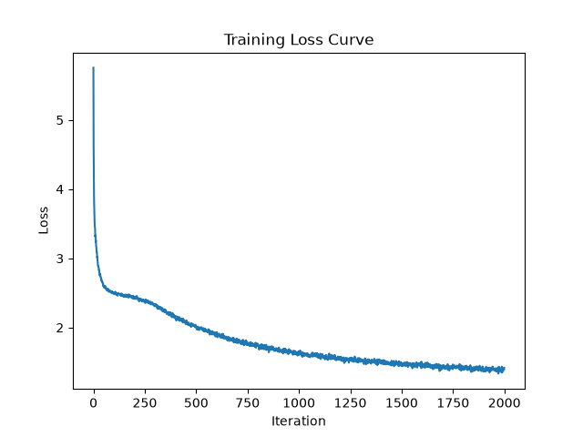
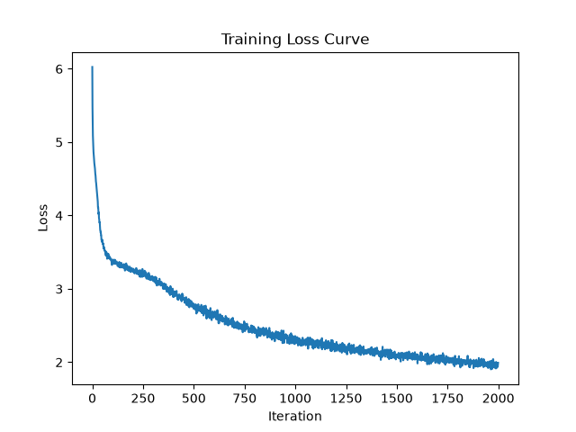
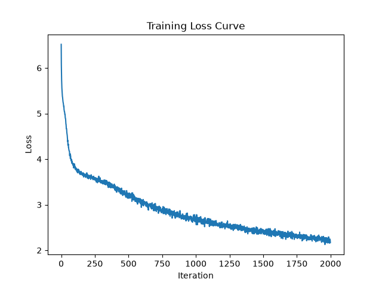
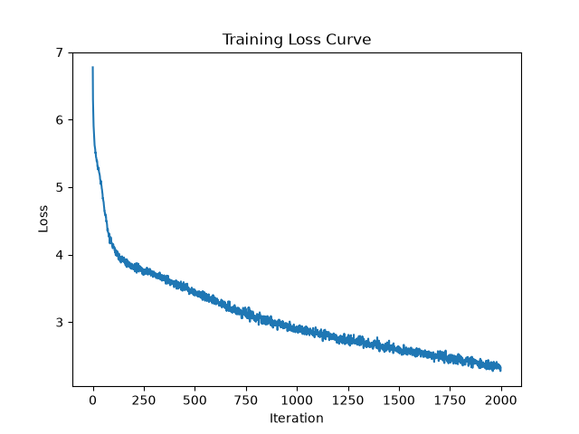
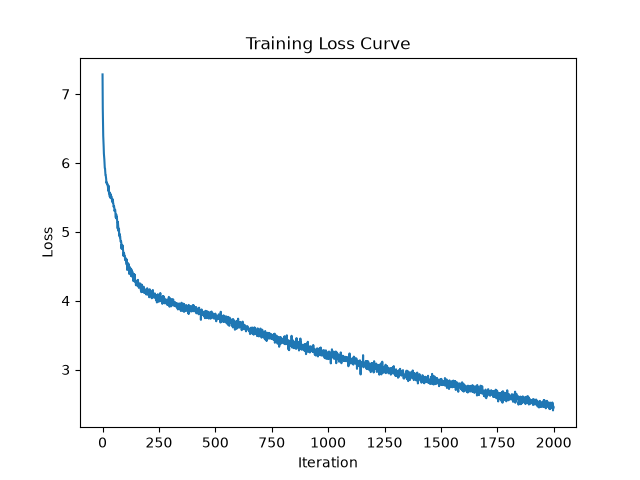
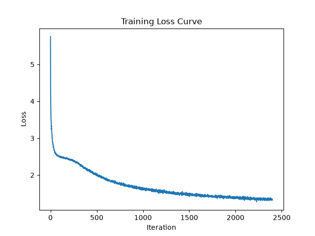

# BPE Tokenization Experiments

## Goal

Understand the actual value of adding BPE to the baseline transformer (the first
addition made on top of it) by comparing performance without BPE against BPE at
different merge counts.

## Method

All hyperparameters held constant except merge count:

| Hyperparameter | Value |
|---|---|
| `batch_size` | 64 |
| `block_size` | 256 |
| `max_iters` | 2000 |
| `eval_interval` | 200 |
| `learning_rate` | 3e-4 |
| `eval_iters` | 200 |
| `n_embd` | 384 |
| `n_head` | 6 |
| `n_layer` | 6 |
| `dropout` | 0.2 |

Iteration count is capped at 2000 (rather than run to full convergence) as a
time/signal tradeoff since full runs take hours each on the available hardware (MPS).

**Metrics tracked:**
- Final train / validation loss
- Loss curve
- Chars-per-token (cpt) : characters / tokens on the validation set
- Wall-clock time per iteration
- Generation quality (qualitative)
- Bits-per-byte (bpb) : `val_loss / (cpt × ln(2))` for natural log cross entropy

## Results summary

| Round | Merges | Final val loss | Final val bpb | cpt (val) | ms/iter | Overfit gap (val - train) |
|---|---|---|---|---|---|---|
| 1 | 0 | 1.5521 | 2.2392 | 1.0000 | ~708 | 0.2399 |
| 4 | 100 | 2.3886 | 2.1532 | 1.6005 | ~689 | 0.5655 |
| 5 | 300 | 2.9202 | 2.1634 | 1.9474 | ~691 | 0.9072 |
| 2 | 500 | 3.2116 | 2.1692 | 2.1384 | ~667 | 1.0038 |
| 3 | 1000 | 3.6472 | 2.2390 | 2.3500 | ~691 | 1.5032 |

*Ordered by merge count. Loss is not comparable across rows directly since
vocabulary changes with merge count : bpb is the fair comparison metric.*

I decided this wasn't an accurate ablation experiment since I didn't run to convergence, so I ran the baseline and 500 merges to convergence. The results are summarized below.

| Round | Merges | Final val loss | Final val bpb | cpt (val) | ms/iter | Overfit gap (val - train) | Iters to convergence |
|---|---|---|---|---|---|---|---|
| 1 | 0 | 1.5303 | 2.2078 | 1.0000 | ~664 | 0.2615 | ~2200 |
| 2 | 500 | 3.1794 | 2.1778 | 2.1062 | ~668 | 1.0252 | ~1900 |

BPE allows the model to converge significantly faster (~300 less iterations), to a lower bpb, and with a similar time per iteration. The outputs are generally similar in quality, though the BPE version produces longer versions (obviously) with marginally more coherence (though that could just be random). That being said, there's a clear cost of overfitting with BPE.

## Key findings

**Loss curves, ascending merge count:**

| 0 merges (baseline) | 100 merges | 300 merges | 500 merges | 1000 merges |
|---|---|---|---|---|
|  |  |  |  |  |

Here are my major takeaways:
- The graph shape changes consistently with increased merge count. The baseline has clear "beginner gains" that get less and less prominent with more merges. This is likely because: (1) The easy beginner wins happen when there is a smaller vocab size so certain tokens are a lot more common and easy to fit to. As I increase vocab size, there aren't as many easy wins because each token is less common. (2) Some "beginner wins" are already incorporated in the tokenizer. For example, the tokenizer may already group "ing" so the model doesn't need to learn to predict i->n->g.
- Overfitting grows with merge count (which makes sense). My hypothesis is that this is because (1) the BPE model has more parameters with the large vocab and is more prone to overfitting and also (2) that the tokenizer itself is a little overfit to the training data since it was trained on the same corpus. I might investigate this again by training the tokenizer on text that isn't the exact training data.
- 500 has the lowest ms/iter of all the different merge counts. I can't pinpoint exactly why, probably something related to my hardware that I haven't learned or just noise (might rerun in the future to further investigate). I'd expect ms/iter to increase with merge count since the embedding layer is larger, but that doesn't hold up. 
- If I didn't have a fixed context length, the BPE tokenizer would probably increase efficiency by reducing the length of the input sequence. 
- BPB is fairly stable, dipping around 100-500 merges and rising again at 1000 merges. This makes sense based on the overfitting point.
- A next step I'd want to do is training to val loss convergence rather than just BPB and see how much my results change.

Generally, I definitely see the benefits of BPE, and I think a lot of the downsides I'm seeing here with overfitting are because of my small dataset.

## Per-round detail

### Round 1 : Baseline (0 merges)

```
chars-per-token: train 1.0000, val 1.0000
step  200: train 2.4164, val 2.4425, bpb 3.5238, 667.97 ms/iter
step  400: train 2.0936, val 2.1633, bpb 3.1209, 661.36 ms/iter
step  600: train 1.8197, val 1.9437, bpb 2.8041, 658.63 ms/iter
step  800: train 1.6602, val 1.8178, bpb 2.6226, 659.27 ms/iter
step 1000: train 1.5501, val 1.7350, bpb 2.5031, 659.10 ms/iter
step 1200: train 1.4791, val 1.6767, bpb 2.4189, 658.55 ms/iter
step 1400: train 1.4246, val 1.6344, bpb 2.3580, 701.02 ms/iter
step 1600: train 1.3781, val 1.5947, bpb 2.3007, 706.55 ms/iter
step 1800: train 1.3445, val 1.5754, bpb 2.2728, 702.58 ms/iter
step 2000: train 1.3122, val 1.5521, bpb 2.2392, 708.24 ms/iter
```


**Sample output**

```
th,
Ay in a foul to our oads along the grief,
But sevel thou for Ravein thy shat name,
And the did incham opprosic part to them.

CAMILLO:
I'll not see thee, Capulet, or where strength speach
Here with Richard's ask no the mocks died
That beggandin plains, thy hearth, there are nearfulless
Will of thy case roop for laying drack of with fair;
Whiphea's brite firge's what's in the core,
And look, onfing my broth, with spirates him.
Stave frither, dank proverain,
As cusince him wield.

Nurse:
By he
```


---

### Round 2 : 500 merges

```
chars-per-token: train 2.2327, val 2.1384
step    0: train 6.3093, val 6.2699,                1279.39 ms/iter
step  200: train 3.7914, val 3.9761, bpb 2.6825,      681.45 ms/iter
step  400: train 3.5353, val 3.7741, bpb 2.5462,      681.87 ms/iter
step  600: train 3.2121, val 3.5278, bpb 2.3797,      685.22 ms/iter
step  800: train 2.9614, val 3.3478, bpb 2.2582,      669.98 ms/iter
step 1000: train 2.7592, val 3.2536, bpb 2.1953,      664.90 ms/iter
step 1200: train 2.6090, val 3.1878, bpb 2.1509,      667.11 ms/iter
step 1400: train 2.4703, val 3.1738, bpb 2.1414,      665.68 ms/iter
step 1600: train 2.3345, val 3.1631, bpb 2.1341,      667.40 ms/iter
step 1800: train 2.2049, val 3.1903, bpb 2.1525,      667.09 ms/iter
step 2000: train 2.2078, val 3.2116, bpb 2.1692,      666.81 ms/iter
```


**Sample output (truncated in source)**

```
court is, injust of it.
Your honour intent made for time; coward finding greatness,
As Still but night shall paradise which
As cries for hate it, for no more empty dive sorrow.
GREMIO:
The word 'Of Fear and i' the eye belongs:
So, my lord. Turn my grows!' they do sound, sir;
Questaid, good Signior Baptista!
Mastera, never to acquaint Alas,
Though Paulina's love to me.
In this devise Rome, I pray thee, give me thou;
And see what keeper than thou art.
BA Place; I do could have more help
Is a truthless sms was true; for hence:
God-place will boot, and tooth all these woes,
Have I left weightness wint a roeat;
And I am crada bed, seeing more,
Than become my creaged torment's wind will bear me.
Will no more law
Deser hatered of her death,
If I must confess of a word's daughter; then your flood, throngs' handless
Since present watch word in your down,
And yet she unleeply bite danger:
And when I had so doubterer, may serve your plead,
And sever'd succlof,
I'll dally a true flies are marigal to his royal now.
DUKE OF YORK:
Can this bride the aunt of mine eyes.
DUKE OF YORK:
Yet givener, my grandam, lords, g
```


---

### Round 3 : 1000 merges

```
chars-per-token: train 2.5775, val 2.3500
step  200: train 4.0916, val 4.1997, bpb 2.5782, 701.14 ms/iter
step  400: train 3.8238, val 3.9761, bpb 2.4410, 686.26 ms/iter
step  600: train 3.5838, val 3.8123, bpb 2.3404, 679.09 ms/iter
step  800: train 3.3149, val 3.6534, bpb 2.2429, 689.73 ms/iter
step 1000: train 3.0793, val 3.5579, bpb 2.1842, 680.91 ms/iter
step 1200: train 2.8817, val 3.5344, bpb 2.1698, 675.84 ms/iter
step 1400: train 2.7074, val 3.5327, bpb 2.1688, 680.70 ms/iter
step 1600: train 2.5145, val 3.5500, bpb 2.1794, 680.29 ms/iter
step 1800: train 2.3301, val 3.5913, bpb 2.2048, 676.05 ms/iter
step 2000: train 2.1440, val 3.6472, bpb 2.2390, 691.47 ms/iter
```

Note: train loss keeps falling past step 1200 while val loss and val bpb bottom
out around step 1400 and then rise : the clearest overfitting signal of the five
runs.


**Sample output**

```
cares follow in this's brother being rave:
Good mistrother, if thou think'st me thy name,
Save them light, the mount of all my king,
That my queen, my daughter's here, mightial to my Verona fault,
My brother traitor and my brother.

LADY ANNE:
And you other be with rail upon my soul.

GLOUCESTER:
And speed my father, in his curses place with him!

LADY ANNE:
O, you peradful time of vengethen!
That press do not profrication uion but a pace
But that poison that adden days from hardict this suit hangman
Which for my black mile;
How fares my soul shall I fear my brother Masters sway;
In my mect's task'd my despisedness of my witness
A was prodigations,
And not my sprors mantairs are returned in your fate:
For me, I do not lose my soul to thee;
Four couch me with some released me travel,
If you treason say I strip, you found beat unto up the part of you,
In you lesson up by the hand: you indept to your emboy;
Your foul wrong, you shall as fall for caveNow Paulara;
Which traitors in pure and paper and cried bitter high,
As you or thy sun, utterance, but to me to prevail.

KING RICHARD II:
Fie, fair vow of befalled; and with praised escap in charge
This hand are nails shallow with strily-wise or escraft of blood.

HENRY BOLINGBROKE:
Sweet Gentle the king at sin thousand seld,
And all with a busation of thy royalty,
HNORTHUMBERLAND:
```


---

### Round 4 : 100 merges

```
chars-per-token: train 1.6218, val 1.6005
step  200: train 3.2294, val 3.3267, bpb 2.9988, 691.74 ms/iter
step  400: train 2.8795, val 3.0546, bpb 2.7535, 673.47 ms/iter
step  600: train 2.5311, val 2.7826, bpb 2.5083, 682.92 ms/iter
step  800: train 2.3213, val 2.6096, bpb 2.3523, 685.24 ms/iter
step 1000: train 2.1957, val 2.5252, bpb 2.2763, 702.84 ms/iter
step 1200: train 2.0925, val 2.4733, bpb 2.2295, 690.22 ms/iter
step 1400: train 2.0138, val 2.4232, bpb 2.1843, 696.91 ms/iter
step 1600: train 1.9394, val 2.4147, bpb 2.1766, 685.89 ms/iter
step 1800: train 1.8823, val 2.3951, bpb 2.1590, 685.29 ms/iter
step 2000: train 1.8231, val 2.3886, bpb 2.1532, 689.26 ms/iter
```


**Sample output**

```
comfort
Is fell unrestaught from, I think with her stewarning oons.
Lords, then.

ISABELLA:
Will you be sly well, to the doing in seat,
And she shall keeps to Romeo.

DUKE VINCENTIO:
Both not you this, like to sive; but thou i' of a
deed, holy were foul deniam it: quick them not are, thou
while we stay with a hearing, shall to die at the number:
A poison of crothechether me in
By mine eye oval and turn thee at my wit, I. You
shepe--which next to him that, come to my broth:
beard-druck not taken. Like the babe stay allower,
a crease: had upon my neck feed entable do blam, and
fore him again alone betternock restrain one do high
came us to thee: this is this should dissember it: a
lover I dog thee would tipel of brought out him; they leave their
dole-buke an oath; easy for them: but if you say boath,
the weak: put it wears, remedy raspe
```


---

### Round 5 : 300 merges

```
chars-per-token: train 2.0096, val 1.9474
step  200: train 3.5977, val 3.7256, bpb 2.7601, 687.81 ms/iter
step  400: train 3.3215, val 3.5171, bpb 2.6056, 665.62 ms/iter
step  600: train 2.9630, val 3.2480, bpb 2.4062, 662.85 ms/iter
step  800: train 2.7189, val 3.0838, bpb 2.2846, 668.76 ms/iter
step 1000: train 2.5547, val 2.9797, bpb 2.2075, 663.76 ms/iter
step 1200: train 2.4236, val 2.9232, bpb 2.1656, 671.04 ms/iter
step 1400: train 2.3083, val 2.9101, bpb 2.1559, 691.32 ms/iter
step 1600: train 2.2098, val 2.9006, bpb 2.1488, 689.92 ms/iter
step 1800: train 2.1074, val 2.8991, bpb 2.1477, 689.78 ms/iter
step 2000: train 2.0130, val 2.9202, bpb 2.1634, 690.82 ms/iter
```


**Sample output**

```
courseserve.

First Murderer:
Ay, a bondman, out sure
A lacks in our blemission.

Second Citizen:
Where is a noble vessel, makes honour head
Are: could the mirth glister'd.

Second Citizen:
I know it expass that you tell men the next Thou would
O, a honour, therein, to Stere you live
Citizens in a fool in this wench.

First Citizen:
Down, my lord.

CORIOLANUS:
What set you do I b dearly appeal?

CORIOLANUS:
Nay, they come bitter for your thing it; being a virgin
That, we have been in your bold fleght,
Should nothing.

CORIOLANUS:
My?

MENENIUS:
Do you sir: I tell you again. He should I had
Titus his good deny: no wanton you at your worth
Your royal complay, his news.

Second Citizen:
I'll brain thee.

COMINIUS:
You have smiling against all this proceeding
It have been i' such a speech; but it is cogg,
If it not a villain, quarrel with an icatcratage or
fold within your envent.
You he have be many hide, come to your best;
End, child, indeed you our title that the day nor
Whe
```


## Qualitative comparison of sample outputs

Loss gets worse with increasing merge count, and the quality of sample outputs 
seem to follow that trend. The baseline (0 merges) reads best by far. Within
the BPE runs, 500 merges is noticeably better than 100 and 300, and 1000 merges
is clearly the worst, with the longest and most tangled token garbling
("HNORTHUMBERLAND," "escraft"). Here's my rough ranking: 0 > 500 > 100 > 300 > 1000
- this ranking isn't conclusive since it's based on one sample + eyeballing

## Open questions

This obviously isn't a very accurate "test" for how useful BPE is since I held all hyperparameters constant and didn't run to convergence. 500 merges does seem to emerge as the best BPE setting, but we 
don't have a clear comparison of how it performs in comparison to the baseline when run to convergence. 

This is also an interesting thing to think about for ablation experiments in general: how do you design an
experiment that accurately compares two different models when it's not feasible to run to convergence? How do you choose the hyperparameters in the first place such that they're optimal for both models?

Regardless, for the integrity of the experiment, I want to do a REAL ablation where I run to convergence for the baseline and for 500 merges to see how BPE actually performs.

Convergence criterion: Validation bpb is evaluated every 100 iterations. Training is considered converged once three consecutive validation bpb measurements fall within a 0.01 range of each other. The reported result is the checkpoint with the lowest validation bpb observed over the run, not necessarily the final step.

### Results:
## Summary

| | Baseline | BPE (500 merges) |
|---|---|---|
| chars/token (val) | 1.0000 | 2.1062 |
| Converged at step | 2400 | 1900 |
| Best val bpb | 2.2041 (step 2200) | 2.1539 (step 1400) |
| ms/iter | ~664 | ~668 |
| loss curves |  |  |

BPE hit a lower best val bpb (2.1539 vs 2.2041) and converged sooner (step 1900 vs 2400), despite similar per-iteration cost, so on a wall-clock basis it's a clearer win than the bpb numbers alone suggest. Looking at the ouputs, they two perform similarly well, though BPE responses are longer and slightly more coherent. Considering it took less time and fewer iterations to get to this point, BPE definitely seems to be a net win in this experiment.

Side note: I changed eval_interval to 100 to get more frequent updates, but I forgot to chagne eval_iters, meaning it was still averaging over the last 200 iterations. Therefore, the loss curve is probably smoother looking than it should be, but the final loss + overall trend is still valid.

### Raw results

**Baseline results (to convergence)**
using MPS
chars-per-token: train: 1.0000, val: 1.0000
step 100: train loss 2.4914, val loss 2.5041, val bpb 3.6126, ms/iter 684.23
step 200: train loss 2.4191, val loss 2.4413, val bpb 3.5220, ms/iter 671.90
step 300: train loss 2.2815, val loss 2.3054, val bpb 3.3260, ms/iter 663.67
step 400: train loss 2.0801, val loss 2.1496, val bpb 3.1012, ms/iter 664.25
step 500: train loss 1.9343, val loss 2.0293, val bpb 2.9276, ms/iter 662.80
step 600: train loss 1.8133, val loss 1.9426, val bpb 2.8026, ms/iter 659.78
step 700: train loss 1.7218, val loss 1.8715, val bpb 2.7000, ms/iter 671.09
step 800: train loss 1.6524, val loss 1.8077, val bpb 2.6080, ms/iter 663.60
step 900: train loss 1.5958, val loss 1.7612, val bpb 2.5408, ms/iter 662.49
step 1000: train loss 1.5471, val loss 1.7313, val bpb 2.4977, ms/iter 663.94
step 1100: train loss 1.5117, val loss 1.7023, val bpb 2.4560, ms/iter 665.61
step 1200: train loss 1.4779, val loss 1.6743, val bpb 2.4155, ms/iter 661.23
step 1300: train loss 1.4499, val loss 1.6465, val bpb 2.3754, ms/iter 665.90
step 1400: train loss 1.4203, val loss 1.6272, val bpb 2.3476, ms/iter 667.07
step 1500: train loss 1.4000, val loss 1.6113, val bpb 2.3246, ms/iter 663.51
step 1600: train loss 1.3780, val loss 1.5991, val bpb 2.3070, ms/iter 664.77
step 1700: train loss 1.3614, val loss 1.5818, val bpb 2.2821, ms/iter 665.46
step 1800: train loss 1.3410, val loss 1.5628, val bpb 2.2546, ms/iter 662.11
step 1900: train loss 1.3276, val loss 1.5612, val bpb 2.2523, ms/iter 661.75
step 2000: train loss 1.3138, val loss 1.5479, val bpb 2.2331, ms/iter 660.11
step 2100: train loss 1.2962, val loss 1.5415, val bpb 2.2239, ms/iter 665.46
step 2200: train loss 1.2847, val loss 1.5278, val bpb 2.2041, ms/iter 662.12
step 2300: train loss 1.2730, val loss 1.5288, val bpb 2.2055, ms/iter 663.58
step 2400: train loss 1.2688, val loss 1.5303, val bpb 2.2078, ms/iter 663.55
converged at step 2400
bed a king holing:
Hall to set reepary'd side Caebproat her,
Mants, and sorried. I twick you see us a widow,
Lord wife untiged with your good our suits:
And, or that set ungent-day's life,
Though being your sod, whom more the seat in all,
I'lds sil part to answering deserby of that saye
Shalt be age to be but again spite worse.

STRON:
It would sin an't.

Nurse:
With safe to will her, madam;
Ay, if thou turn, he troy time:
Yet myster abide purches in the suitssibr's done;
I think steat this patt

**BPE (500 merges) results (to convergence)**
using MPS
chars-per-token: train: 2.2338, val: 2.1062
step 100: train loss 4.0803, val loss 4.1896, val bpb 2.8698, ms/iter 693.59
step 200: train loss 3.7837, val loss 3.9331, val bpb 2.6941, ms/iter 663.59
step 300: train loss 3.6699, val loss 3.8243, val bpb 2.6196, ms/iter 667.92
step 400: train loss 3.5270, val loss 3.7077, val bpb 2.5397, ms/iter 667.40
step 500: train loss 3.3691, val loss 3.6010, val bpb 2.4666, ms/iter 670.65
step 600: train loss 3.2090, val loss 3.4901, val bpb 2.3907, ms/iter 665.41
step 700: train loss 3.0702, val loss 3.3819, val bpb 2.3165, ms/iter 667.34
step 800: train loss 2.9571, val loss 3.3169, val bpb 2.2720, ms/iter 666.82
step 900: train loss 2.8583, val loss 3.2620, val bpb 2.2344, ms/iter 667.82
step 1000: train loss 2.7742, val loss 3.2204, val bpb 2.2059, ms/iter 666.79
step 1100: train loss 2.6914, val loss 3.1877, val bpb 2.1835, ms/iter 666.06
step 1200: train loss 2.6238, val loss 3.1870, val bpb 2.1830, ms/iter 672.01
step 1300: train loss 2.5532, val loss 3.1639, val bpb 2.1672, ms/iter 668.19
step 1400: train loss 2.4856, val loss 3.1445, val bpb 2.1539, ms/iter 674.38
step 1500: train loss 2.4179, val loss 3.1626, val bpb 2.1663, ms/iter 665.37
step 1600: train loss 2.3560, val loss 3.1588, val bpb 2.1637, ms/iter 667.36
step 1700: train loss 2.2910, val loss 3.1748, val bpb 2.1747, ms/iter 672.97
step 1800: train loss 2.2267, val loss 3.1736, val bpb 2.1739, ms/iter 667.20
step 1900: train loss 2.1542, val loss 3.1794, val bpb 2.1778, ms/iter 668.17
converged at step 1900
ail of tails' me my tongue,
Stay; and ne'er was we but knock
Not me by and ears that you can
ementer vengeance for welcall'd death,
And, unroo years to Still never accided which
He can a noble to him, 'mans wine, him took thy preft his heart.

First Hunts no cause;
And speak more than would but fly to prove a lamb:
So throw such as weep forth
To waxeful times would say pardon him with light.

RICHARD:
What, trandam? Then, madam, thy glory is chances;
Which for all duper vile honourable in stuffices,
Thesere of honey sun most oppose crown,
My love town device in sorrowing stines that right of death:
That Anspairs they heavy no he had pity
Thinkerly to my hopead away on up.

SOMERSET:
Come, and stir my Lord;
O, it is banish'd woman, never casting me from fiend,
O that beauty heart in scarled, one love,
Is forth the tide of grief accupil
Upon the poorthy proud tegues and bad tidings
Terman, as after together;
For truth, envy in the nought,
And pins me but out of true many never.

QUEEN MARGARET:
The bitter son's Pauliet smoid, canno twenty himself,
And sing his porting put in the age of tent
But shople professorm