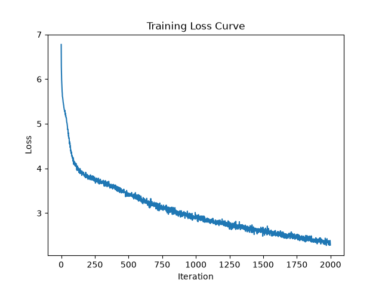

# fp32 vs bf16 ablation

Comparing model performance and training speed using float32 vs bfloat16 matrix values (via `torch.autocast`) in the linear layers.

All hyperparameters are identical between runs except for matrix dtype. Both runs use the same tokenizer (BPE, 500 merges), same dataset (`shakespeare.txt`), same device (MPS), and were run with no other applications open to keep ms/iter comparable.

| Hyperparameter | Value |
|---|---|
| `batch_size` | 64 |
| `block_size` | 256 |
| `max_iters` | 2000 |
| `eval_interval` | 200 |
| `learning_rate` | 3e-4 |
| `eval_iters` | 200 |
| `n_embd` | 384 |
| `n_head` | 6 |
| `n_layer` | 6 |
| `dropout` | 0.2 |

## Results Summary

| Metric | fp32 | bf16 |
|---|---|---|
| Final train loss (step 2000) | 2.2078 | 2.0981 |
| Final val loss (step 2000) | 3.2116 | 3.2095 |
| Final val bpb (step 2000) | 2.1692 | 2.1984 |
| Best val bpb (step) | 2.1341 (step 1600) | 2.1514 (step 1400) |
| Avg ms/iter (steps 200–2000, excl. warmup) | ~670.6 | ~695.9 |
| ms/iter range (steps 200–2000) | 664.9–685.2 | 683.4–727.2 |

Peformance in terms of loss/bpb is extremely similar, which makes sense since the model is the same besides the matrix dtype. The bf16 run is slightly slower on average, but enough that I need a second run to confirm if this is just randomness/noise versus a real effect of bf16.

| Step | fp32 ms/iter | bf16 ms/iter |
|---|---|---|
| 1    | 1279.39 | 920.05 |
| 200  | 681.45  | 684.99 |
| 400  | 681.87  | 684.51 |
| 600  | 685.22  | 684.00 |
| 800  | 669.98  | 683.35 |
| 1000 | 664.90  | 684.21 |
| 1200 | 667.11  | 690.87 |
| 1400 | 665.68  | 727.20 |
| 1600 | 667.40  | 715.39 |
| 1800 | 667.09  | 710.59 |
| 2000 | 666.81  | 693.58 |

** ms/iter is the average time to run a single iteration during the most recent 200 iterations.

This was extremely surprising to me. Initial ms/iter is significantly lower with bf16, but is higher than fp32 for the rest of the run. First of all, this may have something to do with the fact that I'm running on MPS and not CUDA, so there are no tensor cores to accelerate bf16. Regardless, it's quite strange that bf16 ms/iter almost oscillates, increasing and decreasing across iterations but with changing ranges. I'm going to do a second run to confirm if this is one-off or not.

## fp32 results

Using the same run as the 2000-iteration BPE experiment.

```
step    1: train 6.3093, val 6.2699,                1279.39 ms/iter
step  200: train 3.7914, val 3.9761, bpb 2.6825,      681.45 ms/iter
step  400: train 3.5353, val 3.7741, bpb 2.5462,      681.87 ms/iter
step  600: train 3.2121, val 3.5278, bpb 2.3797,      685.22 ms/iter
step  800: train 2.9614, val 3.3478, bpb 2.2582,      669.98 ms/iter
step 1000: train 2.7592, val 3.2536, bpb 2.1953,      664.90 ms/iter
step 1200: train 2.6090, val 3.1878, bpb 2.1509,      667.11 ms/iter
step 1400: train 2.4703, val 3.1738, bpb 2.1414,      665.68 ms/iter
step 1600: train 2.3345, val 3.1631, bpb 2.1341,      667.40 ms/iter
step 1800: train 2.2049, val 3.1903, bpb 2.1525,      667.09 ms/iter
step 2000: train 2.2078, val 3.2116, bpb 2.1692,      666.81 ms/iter
```


**Sample output (truncated):**

```
court is, injust of it.
Your honour intent made for time; coward finding greatness,
As Still but night shall paradise which
As cries for hate it, for no more empty dive sorrow.
GREMIO:
The word 'Of Fear and i' the eye belongs:
So, my lord. Turn my grows!' they do sound, sir;
Questaid, good Signior Baptista!
```

## bf16 results

Using `torch.autocast` to run the model in bfloat16 for 2000 iterations.

```
step    1: train 6.3005, val 6.2852,                 920.05 ms/iter
step  200: train 3.7825, val 3.9333, bpb 2.6943,      684.99 ms/iter
step  400: train 3.5271, val 3.7082, bpb 2.5401,      684.51 ms/iter
step  600: train 3.2017, val 3.4646, bpb 2.3732,      684.00 ms/iter
step  800: train 2.9549, val 3.3071, bpb 2.2653,      683.35 ms/iter
step 1000: train 2.7747, val 3.2235, bpb 2.2081,      684.21 ms/iter
step 1200: train 2.6196, val 3.1658, bpb 2.1685,      690.87 ms/iter
step 1400: train 2.4797, val 3.1409, bpb 2.1514,      727.20 ms/iter
step 1600: train 2.3525, val 3.1676, bpb 2.1697,      715.39 ms/iter
step 1800: train 2.2206, val 3.1625, bpb 2.1663,      710.59 ms/iter
step 2000: train 2.0981, val 3.2095, bpb 2.1984,      693.58 ms/iter
```



**Sample output (truncated):**

```
cellow.

CORIOLANUS:
So.

AUFIDIUS:
Well, your gates, sir,
Your subdience three grazen'd gates
Tullush for the people's ears.

CORIOLANUS:
Call thyOf, which I have done,
Hear not thy kindness, thou hadst fear'd such
Would yet no tongue which I sent myself
That I like therefore i' the pastime put erence.
```

## caveats / follow-ups

- ms/iter numbers are from single runs, not multiple repeats — the variance noted in the bf16 back half means a second run would help confirm whether "bf16 is slower" holds up or was a one-off system noise event.
- No CUDA tensor cores on MPS, so this result shouldn't be read as "bf16 doesn't help" in general — only that it doesn't help *on this hardware, at this model size*.